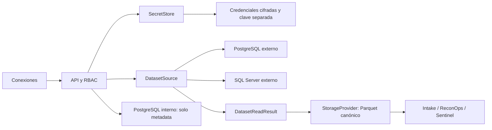

# ADR 0007: Conexiones externas y snapshots de entrada

Estado: implementado para PostgreSQL y SQL Server. Fecha: 19 de septiembre de 2026.

## Decisión

`DatasetSource` sigue siendo el puerto principal de adquisición. Los adaptadores
`PostgreSQLDatasetSource` (psycopg) y `SQLServerDatasetSource` (pymssql/FreeTDS)
descubren metadata y producen `DatasetReadResult`, igual que `LocalFileDatasetSource`.
`DatasetReader` continúa interpretando exclusivamente formatos de archivo.
Ninguna regla de Intake, ReconOps o Sentinel importa estos drivers ni consulta
fuentes externas. Los módulos procesan una DatasetVersion inmutable ya adquirida.

El PostgreSQL interno de Compose guarda conexiones, revisiones, bindings,
DatasetVersions, runs y referencias a artifacts. No recibe una copia de las filas
de las tablas externas. Los snapshots completos acotados se publican como Parquet
mediante `StorageProvider`; no existe un upload original ficticio.

## Identidad, versionado y adquisición

La migración aditiva `0005_external_connections` crea `external_connections`,
`external_connection_versions` y `dataset_source_bindings`. No reescribe runs,
datasets ni configuraciones históricas. La conexión tiene identidad estable y una
revisión entera para concurrencia optimista. Cada edición crea una configuración
inmutable. La contraseña queda representada únicamente por una referencia opaca.
El hash de configuración incorpora esa revisión de credencial, nunca su valor.

Un binding asocia dataset, conexión, schema, tabla/vista y overrides de columnas.
`Actualizar desde fuente` vuelve a adquirir la selección con la versión actual de
la conexión y crea otra DatasetVersion. Una versión anterior sigue apuntando a su
configuración original, aunque se edite, deshabilite o elimine lógicamente la
conexión. Una adquisición fallida no crea una versión parcial.

`ingestion_metadata.source` conserva `source_type`, `connection_id`,
`connection_version_id`, `connection_version`, `config_hash`, `schema_name`,
`object_name`, `object_kind` y `captured_at`. El linaje incluye `SOURCE_SNAPSHOT`
hacia la revisión de conexión y `REFRESH_OF` hacia la versión anterior. Los runs
referencian DatasetVersions; sus manifests incorporan esta metadata. No hace falta
cambiar el contrato de los motores ni el schema 2 del manifest.

## Lectura y límites

- Solo se seleccionan tablas/vistas descubiertas y accesibles. Los identificadores
  se citan según el motor; los parámetros se enlazan mediante el driver. La API no
  recibe SQL arbitrario, sentencias de escritura ni cadenas DSN.
- El preview usa `LIMIT`/`TOP` en origen, de 1 a 100 filas. La consulta de columnas
  usa catálogos del motor; no recorre toda la tabla para detectar su esquema.
- El snapshot local admite hasta `MAX_ROWS` (100.000 por defecto), 100 columnas,
  64 MiB de valores UTF-8 normalizados y 64 KiB por celda. Lee lotes de 100 y una
  fila adicional para detectar exceso. Se rechaza el exceso, sin truncamiento.
- Timeout de conexión: 1 a 15 segundos; de consulta: 1 a 60 segundos. La lectura y
  el profiling siguen siendo síncronos y acotados. Una futura adquisición por jobs
  deberá mantener idempotencia, cancelación y publicación atómica.
- El orden de filas es el devuelto por la BD (`DATABASE_UNSPECIFIED`), no un orden
  estable por clave. `SNAPSHOT_ROW` identifica la posición dentro del snapshot.
  Consultas posteriores pueden producir diferente orden; cada artifact mantiene
  su hash verificable y su evidencia propia.
- Decimal se conserva sin conversión a float; fechas son ISO, Unicode y espacios
  se conservan, null y cadena vacía siguen separados. Binarios se codifican Base64.
  SQL Server `timestamp` es rowversion binario, no fecha; `datetimeoffset(0..6)` y
  PostgreSQL `timestamptz` se leen como `TIMESTAMP` ISO con offset. Los tipos
  temporales sin zona (`timestamp without time zone`, `datetime`, `datetime2` y
  `smalldatetime`) y `datetimeoffset(7)` se adquieren como `STRING`: no se inventa
  una zona horaria ni se pierde precisión, y Delivery conserva su texto exacto.
  Los nombres `id`/`*_id` aplican la política de identificadores existente. Los
  tipos nativos permanecen en metadata.

## Credenciales y transporte

`SecretStore.put/get/delete` es un puerto separado de almacenamiento de artifacts.
`EncryptedFileSecretStore` cifra con Fernet autenticado y vincula cada payload a
organización y referencia. El cifrado persiste en `connection_credentials`; la
clave maestra se crea atómicamente en el volumen independiente `connection_keys`.
Directorios Linux 0700 y archivos 0600; ejecución directa Windows hereda las ACL
de la cuenta local. Ambos volúmenes requieren backup protegido, separado del
backup de artifacts. Perder la clave impide recuperar contraseñas: no se reemplaza
silenciosamente cuando ya existen credenciales cifradas. No hay rotación automática
de clave maestra todavía. Eliminar una conexión conserva las referencias históricas.
Solo la API monta los dos volúmenes de secretos. El worker monta artifacts y
procesa snapshots canónicos sin recuperar credenciales externas.

Las pruebas de borrador y las ediciones pueden reutilizar una contraseña omitida
solo cuando host, puerto, base, usuario y modo TLS coinciden con la versión vigente.
Un cambio de esos campos exige contraseña explícita; sin ella se rechaza antes de
conectar con 422 `PASSWORD_REQUIRED_FOR_ENDPOINT_CHANGE`. Los cambios de nombre o
timeouts conservan la posibilidad de reutilizar el secreto. Así un destino editado
no recibe automáticamente una credencial guardada para otro contexto.

La API no devuelve passwords ni referencias de secreto. Errores de drivers se
convierten a códigos y mensajes constantes, sin DSN ni excepción original. Los
eventos de auditoría usan campos permitidos y actor estable. RBAC distingue lectura
de metadata, uso de una conexión y administración; cada recurso queda acotado a su
organización. Las cuentas autorizadas para usar conexiones pueden adquirir datos
con los permisos externos de esa conexión.

PostgreSQL usa transacciones read-only y `sslmode=require` por defecto. Se ofrecen
`verify-ca`/`verify-full` cuando libpq dispone de las CA necesarias. SQL Server usa
`encryption=require` por defecto; su intención read-only es informativa y NO
sustituye los permisos de la cuenta. Ambos deben configurarse con usuarios SELECT
de mínimo privilegio. El modo `require` exige cifrado pero no debe confundirse con
verificación completa de identidad del servidor; certificados/CA y configuración
de confianza deben administrarse en el entorno del driver. `disable`/`off` se
exponen para redes locales de prueba. Los timeouts FreeTDS son globales al proceso;
el adaptador SQL Server serializa sus conexiones con un lock para evitar carreras.

Las conexiones requieren acceso de red a la fuente. El overlay
`deploy/docker/compose.offline.yml` bloquea salida externa de API y worker; utiliza
el Compose base para fuentes fuera de esa red. Desde Docker Desktop, una BD en el
PC se alcanza normalmente con `host.docker.internal`, no con `localhost`.

## Evolución

Para añadir S3, Azure Blob, REST, Oracle, MySQL, Snowflake o Databricks, implementar
un adaptador de adquisición que entregue el mismo `DatasetReadResult`, registrar
su tipo, opciones permitidas, descubrimiento y pruebas de normalización/seguridad.
La configuración común SQL de esta entrega necesita DTOs específicos al incorporar
fuentes no SQL; el puerto no obliga a inventar host/base/schema para un bucket.

Key Vault, Secrets Manager y Vault implementarán `SecretStore`, con aislamiento,
referencias versionadas y rotación. No son dependencias del prototipo actual.
Un futuro módulo **Destinos / Data Delivery** tendrá un puerto de entrega separado,
permisos propios y semántica de escritura/idempotencia. `DatasetSource` no incluye
write, publish ni export hacia sistemas externos. Descargar Excel al usuario no
es una operación de entrega a una base externa.

## Verificación

`python scripts/tests/connections_cycle.py` levanta PostgreSQL y SQL Server reales
en un proyecto nuevo, con usuarios SELECT y fixtures de tablas/vistas, prueba API,
Intake y UI para ambos, interrumpe y restaura las fuentes y busca secretos en logs,
auditoría y metadata. Elimina solamente sus volúmenes efímeros. Los unitarios cubren
normalización, límites, quoting, errores y cifrado; los de API cubren autorización,
linaje, concurrencia y persistencia. Resultados ejecutados: ver el informe de
validación de Conexiones, separado de esta decisión arquitectónica.
