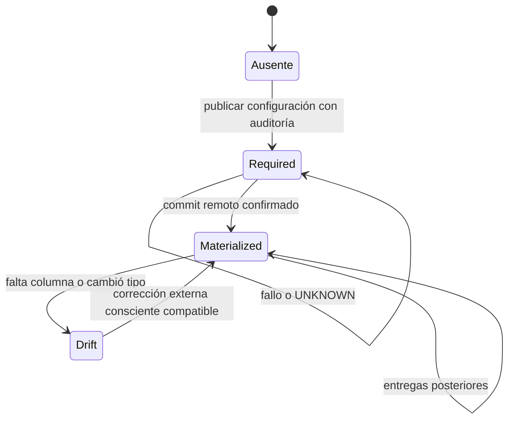

# ADR 0019: Auditoría de última ingesta por target físico

- Estado: implementado; resultados ejecutados se registran en la evidencia de 0.6.0.
- Versión: Trackvance Core 0.6.0.
- Extiende ADR 0015 sin cambiar DatasetSource, DatasetVersion ni UNKNOWN.

## Contexto y alcance

0.5.1 publicaba columnas de negocio y conservaba trazabilidad del intento en
Trackvance, pero las filas remotas no identificaban la última ingesta. 0.6.0
permite incluir juntos `fechaIngesta` y `usuario`. No constituye SHIST, SCD ni
historial de vigencias: UPSERT actualiza estos valores para representar la última
operación Trackvance que insertó o actualizó cada registro. DatasetVersion y sus
artifacts canónicos permanecen inmutables y no reciben columnas técnicas.

## Política persistente e irreversible

`DeliveryTargetPolicy` conserva organización, destino inicial, fingerprint,
motor, host/puerto/base/schema/tabla, habilitador estable y snapshot de username,
fecha de habilitación y `materialized_at`. El fingerprint SHA-256 se calcula
sobre JSON canónico de organización/motor/host/puerto/base/schema/tabla; excluye
usuario de conexión, contraseña, referencia secreta y opciones TLS. Un segundo
Destination o una rotación de credenciales no eluden la política del mismo
locator. Cambiar host, puerto, base, schema o tabla identifica otro target.

El host se normaliza a minúsculas, sin punto final DNS, y las direcciones IP a su
forma canónica. PostgreSQL conserva identidad exacta de base/schema/tabla. SQL
Server normaliza esos componentes con casefold para impedir evasiones mediante
aliases de mayúsculas en servidores case-insensitive; conservadoramente, tablas
distintas sólo por mayúsculas en un servidor case-sensitive comparten requisito.
No se afirma equivalencia automática de aliases DNS distintos o de servidores
con múltiples nombres: el identificador corresponde al locator configurado.

Publicar con `audit_columns_enabled=true` hace preflight y persiste política y
Configuration en la misma transacción local. PostgreSQL usa advisory lock
transaccional derivado del fingerprint incluso antes de que exista la fila,
serializando publicaciones competidoras; la restricción unique añade defensa.
La tabla incluye `CHECK(audit_columns_required = true)`: no existe transición de
required a false ni endpoint de baja o desactivación. Un draft, versión nueva o
run de configuración antigua que omita el flag requerido falla cerrado.

`Drift` es diagnóstico de inspección, no downgrade de la política. No se borra
`materialized_at` ni se reinicia la obligación. Un fallo previo a commit revierte
DDL/DML remotos según el motor; UNKNOWN conserva incertidumbre y nunca afirma
materialización local por deducción.

## Valores, tipos y transacción remota

Run.execution_plan conserva `initiated_by_username` al encolar usando el username
interno del User. Renombrar la cuenta después no cambia lo publicado por esa Run.
El método de autenticación local/Microsoft/Google no interviene en ese valor.
Cada intento prepara un único timestamp UTC con microsegundos antes de STARTED;
el mismo valor se persiste en DeliveryAttempt.system_audit y se vincula como
parámetro para todas las filas. No se llama a `now()` remoto por fila.

| Motor | fechaIngesta | usuario |
|---|---|---|
| PostgreSQL | `"fechaIngesta" TIMESTAMPTZ(6)` | `"usuario" VARCHAR(128)` |
| SQL Server | `[fechaIngesta] DATETIMEOFFSET(6)` | `[usuario] NVARCHAR(128)` |

CREATE_TABLE crea ambos NOT NULL. Sobre EXISTING_TABLE, columnas nuevas son
NULLABLE y no tienen DEFAULT. Las filas que la operación no modifica conservan
NULL/NULL; no se atribuye retrospectivamente una ingesta falsa. APPEND audita las
filas nuevas, OVERWRITE audita todas las resultantes, UPSERT INSERT y UPDATE
incluyen las dos columnas técnicas. Incluso un mapping sólo de claves actualiza
la auditoría cuando UPSERT toca un registro existente.

Preflight inspecciona columnas, tipos, capacidad, precisión temporal y privilegio
ALTER remoto. PostgreSQL requiere timestamp con zona de al menos seis dígitos y
varchar/text con capacidad >=128; SQL Server requiere datetimeoffset de al menos
seis dígitos y nvarchar con capacidad >=128. Identidades/generated no se adoptan.
PostgreSQL exige nombres exactos citados y rechaza aliases lowercase ambiguos.
SQL Server adopta los nombres reales encontrados mediante comparación insensible
a mayúsculas; dos coincidencias ambiguas fallan cerrado. Si falta sólo un campo,
se agrega únicamente ése. No se altera automáticamente un tipo externo.

El adaptador vuelve a inspeccionar bajo lock de la transacción de escritura.
PostgreSQL usa ACCESS EXCLUSIVE para operaciones auditadas; SQL Server conserva
TABLOCKX/HOLDLOCK. Después agrega los campos faltantes y ejecuta DML, con un solo
commit. Un fallo DML revierte también ALTER. El preflight no crea columnas. Los
campos no son parte del mapping de negocio; intentar escribir sobre cualquiera
mediante mapping produce AUDIT_MAPPING_COLLISION antes de iniciar un intento.

## Drift y UNKNOWN

Después de materializar, una columna ausente produce AUDIT_COLUMNS_DRIFT; una
columna incompatible produce AUDIT_COLUMNS_INCOMPATIBLE. No se recrean campos
perdidos silenciosamente. La comprobación se repite bajo lock remoto para cubrir
cambios entre preflight y DML.

Si la primera materialización termina UNKNOWN, policy sigue required y conserva
materialized_at=NULL. STARTED/UNKNOWN no se reintenta automáticamente. Una nueva
operación deliberada inspecciona el target real: adopta ambos campos compatibles,
agrega faltantes compatibles, o falla cerrado. Si confirma su propio commit,
marca materialización sin reescribir el resultado del intento UNKNOWN anterior.

## API, permisos y UI

DeliveryDraft agrega `audit_columns_enabled`, booleano opcional false. El GET
`/delivery/destinations/{id}/target-policy` acepta `schema_name`, `table_name` y
`destination_version_id` opcional. Devuelve `audit_columns_required`, `policy_id`,
`materialized_at` y `target_fingerprint`; funciona antes de crear tabla y no
requiere descifrar credenciales ni acceso remoto. La organización se verifica
antes de consultar política. Preflight añade `system_audit` con nombres reales y
campos faltantes.

`delivery:alter_target` es adicional a permisos ordinarios para crear tabla o
activar auditoría todavía no materializada. Se valida en publicación y encolado;
`delivery:overwrite` sigue siendo obligatorio para OVERWRITE. Los privilegios
Trackvance no sustituyen permisos SQL remotos. La UI muestra la opción conjunta,
la bloquea cuando policy es required y explica la obligación en futuras entregas.
El backend valida independientemente de la UI.

## Evidencia, auditoría, linaje y recuperación

DeliveryAttempt.system_audit conserva enabled, fecha_ingesta, username, policy_id,
columns y columns_created. Mientras el resultado es incierto, columns_created
permanece null, porque no se afirma qué quedó confirmado remotamente. COMMITTED
guarda el booleano obtenido por el adaptador junto con la materialización local,
antes de generar evidencia. Receipt y manifest llevan el mismo snapshot; reparar
evidencia sólo usa información local y verifica consistencia con el plan y el
intento. No recupera el username actual del User ni ejecuta SQL remoto.

ArtifactLink añade Run --AUDITED_TARGET--> DeliveryTargetPolicy. Los eventos
DELIVERY_TARGET_AUDIT_ENABLED, DELIVERY_TARGET_AUDIT_COLUMNS_CREATED y
DELIVERY_TARGET_AUDIT_DRIFT incluyen identificadores permitidos, nunca secretos
ni filas. No se reescriben auditorías o manifests históricos. Draft.snapshot
omite el campo nuevo si no existía en la configuración original para conservar
sus hashes de evidencia.

La migración aditiva 0012 sigue a 0011_notification_delivery, agrega la tabla y
DeliveryAttempt.system_audit; los intentos anteriores reciben `{}`. La baja
controlada de metadata no elimina columnas de bases externas. Backup/restore
debe preservar la nueva tabla y JSON de intentos, y mantiene `.env` fuera del
backup. No hay transacción distribuida entre metadata y target.

## Validación y límites

Los tests cubren fingerprints, tipos/adopción, DDL dentro del commit de DML,
rollback, policy entre destinos, username snapshot, drift, UNKNOWN y evidencia.
El runner aislado `scripts/tests/delivery_cycle.py` amplía PostgreSQL/SQL Server
reales con CREATE, APPEND, UPSERT, OVERWRITE, filas históricas NULL, ALTER denegado,
adopción parcial/completa, colisiones, drift y restart. Su caso UNKNOWN ejecuta
commit real y simula la pérdida del acknowledgement en el adaptador; se etiqueta
así y no se presenta como fallo real de red. Los resultados PASS/FAIL/NOT_RUN se
publican sólo después de ejecutar las pruebas, en la evidencia de versión.
