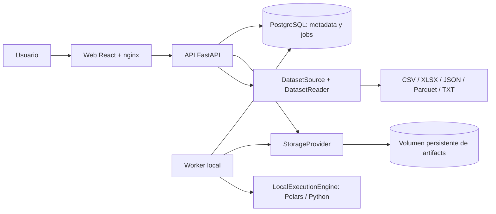

# Arquitectura local y evolución de Trackvance Core

Revisión de implementación: 0.3.0, 16 de septiembre de 2026.

Trackvance es un monolito modular con una API FastAPI, una aplicación React y un
worker que comparte los modelos y servicios del backend. Docker Compose con
PostgreSQL es la instalación local principal. Las reglas y los módulos conservan
sus contratos al sustituir infraestructura mediante puertos. No se plantea dividir
el producto en microservicios para completar esta evolución.

En este documento, **implementado** significa que existe un adaptador funcional;
**preparado** indica una frontera o contrato disponible, con trabajo pendiente para
un nuevo adaptador; **objetivo** describe una capacidad futura. Los resultados de
las comprobaciones ejecutadas se registran por separado en
[validación](development/validation.md).

## Despliegue local implementado

Compose levanta `web`, `api`, `worker` y `postgres`. Solamente `web` publica un
puerto, ligado a `127.0.0.1`. La API y PostgreSQL son accesibles dentro de la red
del proyecto. Los cuatro servicios tienen `restart: "no"`: el usuario inicia
Trackvance manualmente. Una instalación nueva usa puerto 3000; la instalación
`trackvance-certification` de este equipo usa 3100.

El volumen `postgres_data` guarda metadata transaccional: organización, usuarios,
datasets y versiones, configuraciones, runs, jobs, excepciones, auditoría y
referencias de evidencia. El volumen `trackvance_data`, compartido por API y
worker, conserva archivos recibidos, Parquet canónicos, resultados, manifests y
exports. Los bytes de los archivos no se guardan en PostgreSQL. Detener o recrear
contenedores conservando sus volúmenes mantiene ambas partes de la instalación.

El lanzador directo con SQLite permanece como facilidad de desarrollo y pruebas.
Es una instalación separada, con su propia base y almacenamiento en `.local/`.
No representa la topología principal ni comparte datos con PostgreSQL en Compose.

## Puertos y adaptadores

| Frontera | Responsabilidad | Adaptador actual | Evolución preparada |
| --- | --- | --- | --- |
| `StorageProvider` | Publicar artifacts inmutables, leerlos, materializarlos y asignar staging temporal | `FileArtifactStore`, volumen local | S3/Azure Blob, cache local acotado y migración de locators |
| `DatasetSource` | Adquirir datos y entregar `DatasetReadResult` | `LocalFileDatasetSource` | PostgreSQL, SQL Server, APIs y object storage como fuentes |
| `DatasetReader` | Interpretar un formato y normalizar su estructura | CSV, XLSX, JSON/JSON Lines, Parquet, TXT/TSV | Nuevos formatos sin cambios en reglas |
| `ExecutionEngine` | Ejecutar un `Run` persistido y generar su evidencia | `LocalExecutionEngine`, Polars/Python | Adaptador de ejecución distribuida |
| `ProcessingEngine` | Compilar/evaluar expresiones portables de reglas | Compiladores Polars y DuckDB | Otros compiladores con pruebas de paridad |
| `JobQueue` | Registrar la entrega de un run para ejecución asíncrona | `DatabaseJobQueue`, consumida mediante leases | Publicación y consumo Redis/Celery |

`ExecutionPlanner` estima memoria y disco antes de aceptar una ejecución. Elige
POLARS dentro del presupuesto local; si la carga necesita PYSPARK, devuelve
`ENGINE_UNAVAILABLE`, porque el adaptador distribuido todavía no está instalado.
DuckDB sí está implementado para compilación/paridad de reglas y lectura de
metadata Parquet, pero no ejecuta un run completo como motor seleccionable.

Las fronteras son incrementales. Algunos puertos reciben sesiones SQLAlchemy y
modelos ORM; los campos históricos `*_path` siguen almacenando locators locales.
Un adaptador remoto requiere materialización, migración de referencias y pruebas
de consistencia. Redis/Celery requiere además definir la entrega transaccional
entre el run y el mensaje. El puerto por sí solo no implementa esas garantías.
Estas limitaciones se detallan en [ADR 0006](adr/0006-architecture-ports.md).

## Responsabilidades del código

Las capas son lógicas dentro del paquete actual. Se mantienen los archivos y
contratos existentes para evitar una reorganización que rompa compatibilidad;
todavía no hay paquetes `domain/`, `application/`, `infrastructure/` y `api/`
completamente independientes.

| Responsabilidad | Archivos principales | Alcance |
| --- | --- | --- |
| API y autorización | `backend/src/trackvance/api.py`, `permissions.py` | HTTP, sesiones, CSRF, permisos y ámbito de organización |
| Aplicación | `services.py`, `dashboard.py` | Casos de uso, versiones, ejecución, excepciones y cockpit |
| Semántica de dominio | `config_semantics.py`, `processing.py`, `portable_engine.py`, `manifests.py` | Configuraciones declarativas, reglas, resultados y evidencia |
| Modelo persistido | `models.py`, `db.py`, `backend/migrations/` | ORM, transacciones y evolución del schema |
| Almacenamiento y entrada | `artifactstore.py`, `dataset_readers.py` | Puertos, adaptadores locales, integridad y lectura multiformato |
| Ejecución asíncrona | `execution.py`, `jobqueue.py`, `worker.py`, `planner.py` | Entrega de jobs, leases, heartbeat, presupuesto y procesamiento |
| Presentación | `frontend/src/` | Pantallas React, formularios, estados, navegación y cliente HTTP |
| Operación | `compose.yml`, `deploy/`, `scripts/`, `.github/workflows/` | Imágenes, proxy, arranque, diagnósticos y comprobaciones |

El código de aplicación solicita publicación/materialización de artifacts al
proveedor; no construye rutas desde `STORAGE_DIR`. Los paths físicos, staging y
verificación de límites permanecen en el adaptador local. Planner, heartbeat e
inicialización SQLite pueden consultar el filesystem como infraestructura local.

## Módulos funcionales y trazabilidad

| Módulo | Responsabilidad actual |
| --- | --- |
| Datasets | Inspección acotada, tipos corregibles, identificadores, áreas, versiones inmutables y linaje |
| Data Intake | Contratos, transforms explícitos, reglas por columna/registro, decisión y salida canónica Parquet |
| ReconOps | Claves normalizadas explícitamente, comparación exacta, tolerancias absolutas/porcentuales/temporales y agregación simple 1:N sum/count |
| Sentinel | Schema, nulls, frescura, volumen, distinct/uniqueness, reglas declarativas y bandas históricas median/IQR |
| Excepciones | Hallazgo y configuración de origen, gestión, validación posterior, resolución técnica y cierres administrativos diferenciados |
| Centro de Control | Filtros, salud, fallos, atención priorizada, tendencias y navegación a recursos |
| Auditoría e identidad | Actor estable, eventos sanitizados, sesión, CSRF, permisos y aislamiento por organización |

Cada DatasetVersion conserva artifacts y hashes. Las configuraciones publicadas
son snapshots; modificar una configuración crea una versión. Cada run conserva
inputs, configuración efectiva, motor y evidencia. Un error técnico de ejecución
es distinto de un rechazo, diferencia o alerta de negocio. Los manifests schema 2
tienen actores estructurados y referencias completas a artifacts, con lectura
compatible de manifests v1. Los informes Excel de Intake, ReconOps y Sentinel
incluyen resumen, resultados y trazabilidad.

Una excepción conserva su hallazgo y run originales. Resolverla exige una
ejecución posterior del mismo snapshot de control que demuestre la corrección
según el módulo. El run original no cambia. Los cierres administrativos exigen
motivo y no equivalen a una resolución técnica. La automatización de la resolución
queda como ampliación posterior.

## Arquitectura local y arquitectura de producto

| Componente | Local implementado | Producto objetivo |
| --- | --- | --- |
| Despliegue | Docker Compose, cuatro servicios | Kubernetes: AKS, EKS u OpenShift; mismos límites del monolito |
| Metadata | PostgreSQL 16 en volumen | PostgreSQL administrado, políticas de disponibilidad y recuperación |
| Artifacts | `FileArtifactStore` en volumen | S3 o Azure Blob mediante `StorageProvider` |
| Fuentes | Cinco formatos de archivo | PostgreSQL, SQL Server, S3, Azure Blob y APIs mediante `DatasetSource` |
| Procesamiento | Polars/Python; DuckDB para reglas portables | Polars y PySpark según presupuesto y capacidad instalada |
| Cola | Jobs PostgreSQL, leases, reintentos y heartbeat | Redis/Celery con entrega fiable y workers escalables |
| Identidad | Sesión local/demo, CSRF y RBAC backend | OIDC/SSO y administración completa de identidades |
| Secretos | Variables de entorno y `.env` local excluido de Git | Key Vault o Vault y rotación |
| Observabilidad | Logs, readiness, heartbeat y auditoría | OpenTelemetry, Prometheus y Grafana |
| Infraestructura | Compose y scripts operativos | Terraform, Helm y despliegues controlados |
| Entrega | Workflow de checks backend/frontend/migraciones/E2E | Controles de seguridad, dependencias e imágenes y promoción de entornos |

No se han añadido dependencias cloud al prototipo. Kubernetes, Redis/Celery,
PySpark runtime, OIDC, gestores de secretos, telemetría distribuida y Terraform/Helm
son objetivos de producto; su presencia en este mapa no significa que existan
adaptadores o despliegues certificados.

## Seguridad, operación y límites

La autorización se comprueba en backend, incluidos exports y downloads. El ámbito
de organización se conserva en metadata y artifacts. Los eventos registran actor
estable y metadata sanitizada; las opciones de lectura no deben contener tokens,
passwords ni cadenas de conexión. `.env`, almacenamiento, archivos de usuario,
backups y resultados de pruebas quedan excluidos de Git. El acceso demo es para
revisión local y requiere sustitución antes de una exposición de producto.

La carga admite por defecto 10 MiB, 100.000 filas y 100 columnas. La inspección
previa usa hasta 100 registros cuando corresponde, o metadata embebida Parquet;
no exige un escaneo completo sólo para ofrecer las columnas. La carga/perfil
inicial permanece síncrona y acotada. Las ejecuciones de módulos pasan al worker.
La lectura XLSX/JSON y el profiling de gran volumen requieren una evolución
asíncrona antes de ampliar estos límites.

La revisión del schema actual es `0004_exception_validation`; los cambios de
schema futuros deben usar nuevas migraciones Alembic. El desacoplamiento mediante
puertos no cambia tablas ni reescribe evidencia histórica. Los runbooks de
arranque, reinicio, comprobación de hashes y copias están en
[operación](development/operations.md). El backup integral automatizado de
PostgreSQL y artifacts sigue pendiente; el utilitario de backup actual es para
SQLite.

## Secuencia de evolución

1. Incorporar un adaptador de fuente con credenciales externas y límites en el
   origen; certificar su normalización contra los lectores actuales.
2. Incorporar almacenamiento remoto, materialización acotada y una migración de
   locators; conservar IDs, hashes y linaje existentes.
3. Incorporar Redis/Celery con entrega transaccional, idempotencia, cancelación y
   recuperación verificadas; conservar las transiciones de jobs y runs.
4. Implementar PySpark tras pruebas de paridad de reglas, presupuestos y evidencia;
   habilitar el planner sólo cuando el motor esté realmente disponible.
5. Añadir OIDC, secretos, observabilidad y despliegue Kubernetes; certificar
   aislamiento, recuperación, escala y CI/CD antes de declarar operación de producto.

Cada paso conserva las configuraciones versionadas, las reglas declarativas, los
resultados de negocio y la trazabilidad de los módulos.
