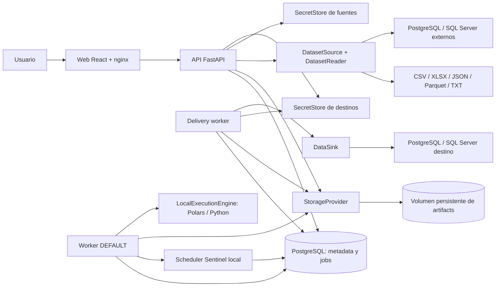

# Arquitectura local y evolución de Trackvance Core

Revisión de implementación: 0.5.1, hardening operacional de Data Delivery,
25 de septiembre de 2026. La certificación integrada se registra por separado;
los resultados históricos no certifican automáticamente esta revisión.

Trackvance es un monolito modular con una API FastAPI, una aplicación React y
dos workers que comparten los modelos y servicios del backend. Docker Compose con
PostgreSQL es la instalación local principal. Las reglas y los módulos conservan
sus contratos al sustituir infraestructura mediante puertos. No se plantea dividir
el producto en microservicios para completar esta evolución.

En este documento, **implementado** significa que existe un adaptador funcional;
**preparado** indica una frontera o contrato disponible, con trabajo pendiente para
un nuevo adaptador; **objetivo** describe una capacidad futura. Los resultados de
las comprobaciones ejecutadas se registran por separado en
[validación](development/validation.md).

## Despliegue local implementado

Compose levanta `web`, `api`, `worker`, `delivery-worker` y `postgres`. Solamente `web` publica un
puerto, ligado a `127.0.0.1`. La API y PostgreSQL son accesibles dentro de la red
del proyecto. Los cinco servicios tienen `restart: "no"`: el usuario inicia
Trackvance manualmente. Una instalación nueva usa puerto 3000; la instalación
`trackvance-certification` de este equipo usa 3100.

El volumen `postgres_data` guarda metadata transaccional: organización, usuarios,
datasets y versiones, configuraciones, runs, jobs, excepciones, auditoría y
referencias de evidencia, incluidos destinos/revisiones/intentos de Delivery. El
volumen `trackvance_data`, compartido por API y ambos workers, conserva archivos recibidos, Parquet canónicos, resultados, manifests y
exports. Los bytes de los archivos no se guardan en PostgreSQL. Detener o recrear
contenedores conservando sus volúmenes mantiene esas partes de la instalación.
Solo la API monta los secretos de fuente (`connection_credentials` y
`connection_keys`) y de destino (`delivery_credentials` y `delivery_keys`). El
worker `DEFAULT` accede únicamente a `trackvance_data`; el `delivery-worker`
accede a artifacts y secretos de destino, pero nunca a los de fuente. La
recuperación requiere conservar metadata, artifacts y los cuatro volúmenes de
secretos de forma coordinada y con acceso restringido.

El lanzador directo con SQLite permanece como facilidad de desarrollo y pruebas.
Es una instalación separada, con su propia base y almacenamiento en `.local/`.
No representa la topología principal ni comparte datos con PostgreSQL en Compose.

## Puertos y adaptadores

| Frontera | Responsabilidad | Adaptador actual | Evolución preparada |
| --- | --- | --- | --- |
| `StorageProvider` | Publicar artifacts inmutables, leerlos, materializarlos y asignar staging temporal | `FileArtifactStore`, volumen local | S3/Azure Blob, cache local acotado y migración de locators |
| `DatasetSource` | Adquirir datos y entregar `DatasetReadResult` | Archivos locales, PostgreSQL y SQL Server | APIs, otros motores y object storage como fuentes |
| `DataSink` | Descubrir targets, validar permisos y publicar una DatasetVersion mediante transacción remota | PostgreSQL y SQL Server | S3/Blob/REST, warehouses u otros sinks con contratos específicos |
| `SecretStore` | Guardar y recuperar credenciales aisladas por organización | Fernet en volumen local; clave en volumen separado | Key Vault, Secrets Manager o Vault |
| `DatasetReader` | Interpretar un formato y normalizar su estructura | CSV, XLSX, JSON/JSON Lines, Parquet, TXT/TSV | Nuevos formatos sin cambios en reglas |
| `ExecutionEngine` | Ejecutar un `Run` persistido y generar su evidencia | `LocalExecutionEngine`, Polars/Python | Adaptador de ejecución distribuida |
| `ProcessingEngine` | Compilar/evaluar expresiones portables de reglas | Compiladores Polars y DuckDB | Otros compiladores con pruebas de paridad |
| `JobQueue` | Registrar la entrega de un run para ejecución asíncrona | `DatabaseJobQueue`, consumida mediante leases | Publicación y consumo Redis/Celery |
| `NotificationDelivery` | Contrato de entrega de alertas externas | Sin adaptador; Findings internos operativos | Email, Teams, Slack o Webhook |

`ExecutionPlanner` estima memoria y disco antes de aceptar una ejecución. Elige
POLARS dentro del presupuesto local; si la carga necesita PYSPARK, devuelve
`ENGINE_UNAVAILABLE`, porque el adaptador distribuido todavía no está instalado.
DuckDB sí está implementado para compilación/paridad de reglas y lectura de
metadata Parquet, pero no ejecuta un run completo como motor seleccionable.

Las fronteras son incrementales. Algunos puertos reciben sesiones SQLAlchemy y
modelos ORM; los campos históricos `*_path` siguen almacenando locators locales.
Un adaptador remoto requiere materialización, migración de referencias y pruebas
de consistencia. Redis/Celery requiere además definir la entrega transaccional
entre el run y el mensaje. El puerto por sí solo no implementa esas garantías.
Estas limitaciones se detallan en [ADR 0006](adr/0006-architecture-ports.md).

## Responsabilidades del código

Las capas son lógicas dentro del paquete actual. Se mantienen los archivos y
contratos existentes para evitar una reorganización que rompa compatibilidad;
todavía no hay paquetes `domain/`, `application/`, `infrastructure/` y `api/`
completamente independientes.

| Responsabilidad | Archivos principales | Alcance |
| --- | --- | --- |
| API y autorización | `backend/src/trackvance/api.py`, `permissions.py` | HTTP, sesiones, CSRF, permisos y ámbito de organización |
| Aplicación | `services.py`, `dashboard.py` | Casos de uso, versiones, ejecución, excepciones y cockpit |
| Conexiones | `connections_api.py`, `connections_service.py` | Endpoints, prueba, configuración versionada, bindings, adquisición y linaje |
| Fuentes externas | `dataset_sources.py` | Adaptadores PostgreSQL/SQL Server de solo lectura, metadata, límites y representación normalizada |
| Data Delivery | `delivery_api.py`, `delivery_service.py`, `delivery_schemas.py`, `delivery_metrics.py` | Destinos/configuraciones versionados, preview, preflight, intentos, reparación local, revisiones UNKNOWN, métricas, receipt, manifest y linaje |
| Destinos externos | `data_sinks.py` | Puerto y adaptadores PostgreSQL/SQL Server, tipos, quoting, permisos, estrategias y transacción remota |
| Credenciales | `credential_store.py`, `delivery_credential_store.py` | SecretStores separados, cifrado local y aislamiento por organización/recurso |
| Semántica de dominio | `config_semantics.py`, `processing.py`, `portable_engine.py`, `manifests.py` | Configuraciones declarativas, reglas, resultados y evidencia |
| Modelo persistido | `models.py`, `db.py`, `backend/migrations/` | ORM, transacciones y evolución del schema |
| Almacenamiento y entrada | `artifactstore.py`, `dataset_readers.py` | Puertos, adaptadores locales, integridad y lectura multiformato |
| Ejecución asíncrona | `execution.py`, `jobqueue.py`, `worker.py`, `planner.py` | Entrega de jobs, leases, heartbeat, presupuesto y procesamiento |
| Sentinel programado | `scheduler.py`, `sentinel_api.py` | Programaciones, revisiones, ocurrencias, despacho transaccional e histórico de series |
| Gestión de casos | `exceptions_api.py` | Responsable, prioridad, SLA, comentarios, adjuntos y filtros; validación compartida en servicios |
| Administración local | `identity_api.py` | Usuarios, roles base, permisos, contraseñas, revocación de sesiones y auditoría |
| Presentación | `frontend/src/` | Pantallas React, formularios, estados, navegación y cliente HTTP |
| Operación | `compose.yml`, `deploy/`, `scripts/`, `.github/workflows/` | Imágenes, proxy, arranque, diagnósticos y comprobaciones |

El código de aplicación solicita publicación/materialización de artifacts al
proveedor; no construye rutas desde `STORAGE_DIR`. Los paths físicos, staging y
verificación de límites permanecen en el adaptador local. Planner, heartbeat e
inicialización SQLite pueden consultar el filesystem como infraestructura local.

## Módulos funcionales y trazabilidad

| Módulo | Responsabilidad actual |
| --- | --- |
| Datasets | Inspección acotada, tipos corregibles, identificadores elegidos desde el esquema, áreas, versiones inmutables y linaje |
| Conexiones | Configuración versionada, prueba de acceso, descubrimiento SQL, preview acotado y snapshots de entrada |
| Data Intake | Contratos, catálogo de responsables, transforms con preview, reglas simples/compuestas, tipo/longitud/rango/fecha, condiciones, comparaciones e integridad referencial contra snapshots |
| ReconOps | Claves simples/compuestas con preview, transforms por lado, comparación por columna, nulls, tolerancias y agregaciones 1:N/N:1 SUM/COUNT |
| Sentinel | Selectores por esquema, schema/nulls, frescura, volumen, distinct/uniqueness, bandas median/IQR, programación local, alertas internas y series compatibles |
| Data Delivery | Destinos PostgreSQL/SQL Server, mapping tipado, preview/preflight, configuraciones inmutables, estrategias CREATE_AND_LOAD/APPEND/OVERWRITE/UPSERT, lane separada, intentos, UNKNOWN, reparación local, revisiones operativas, receipt y linaje |
| Excepciones | Hallazgo/configuración, responsable, prioridad, SLA, adjuntos, reapertura, validación posterior, resolución automática opcional y cierres administrativos |
| Centro de Control | Filtros, salud, fallos, atención priorizada, tendencias y navegación a recursos |
| Auditoría e identidad | Administración local de usuarios/roles, actor estable, eventos sanitizados, sesiones, CSRF y aislamiento por organización |

Cada DatasetVersion conserva artifacts y hashes. Las configuraciones publicadas
son snapshots; modificar una configuración crea una versión. Cada run conserva
inputs, configuración efectiva, motor y evidencia. Un error técnico de ejecución
es distinto de un rechazo, diferencia o alerta de negocio. Los manifests schema 2
tienen actores estructurados y referencias completas a artifacts, con lectura
compatible de manifests v1. Los informes Excel de Intake, ReconOps y Sentinel
incluyen resumen, resultados y trazabilidad.

Una excepción conserva su hallazgo y run originales. Resolverla exige una
ejecución posterior del mismo snapshot de control que demuestre la corrección
según el módulo. El run original no cambia. Los cierres administrativos exigen
motivo y no equivalen a una resolución técnica. La política automática por caso,
apagada por defecto, aplica la misma validación desde el worker y registra actor
SYSTEM y run confirmatorio. Las reglas nuevas tienen `rule_id`: cero filas
evaluadas no demuestra corrección. Una reapertura exige evidencia posterior nueva.
En casos abiertos legacy, la identificación compatible por código/columna exige
también contadores suficientes; ausencia de Finding sin evaluación demostrable
no habilita un nuevo cierre. Los casos ya resueltos conservan su historia.

### Configuración asistida por esquema

Desde 0.4.1, la interfaz utiliza el esquema y la muestra acotada de la DatasetVersion
seleccionada para reducir entradas libres sin cambiar los contratos del motor.
Al cargar o versionar un dataset, los identificadores se eligen desde las
columnas inspeccionadas, con selección individual o **Todos**; se eliminó la
entrada adicional de nombres que duplicaba esa decisión.

Data Intake, ReconOps y Sentinel construyen el catálogo de **Responsable** a
partir de valores ya conocidos en datasets y configuraciones del módulo. Al
crear una configuración se puede seleccionar uno existente o registrar una
etiqueta nueva. El backend continúa recibiendo y persistiendo el mismo campo
`owner`; el catálogo es una ayuda de presentación y no una nueva entidad de
identidad ni sustituye la asignación de usuarios en Excepciones.

TransformBuilder conserva los tipos persistidos `trim`, `case`,
`unicode_normalization`, `empty_to_null`, `id_padding`, `remove_characters`,
`decimal_parse` y `date_parse`, pero presenta sus nombres funcionales. La UI
calcula localmente un ejemplo y una tabla **Antes / Después** de hasta ocho
valores de la muestra real de la columna. Las transformaciones se aplican al
preview en el mismo orden visible y se pueden reordenar. Si un parseo decimal o
de fecha falla, la muestra indica **No se pudo interpretar; la transformación
conservó el valor que recibió.** Una transformación posterior de la misma cadena
puede operar sobre él. La vista previa de fecha sólo interpreta el subconjunto
determinístico que el navegador puede reproducir con certeza. Ante directivas
Python no soportadas muestra **Vista previa no disponible para este formato; la
ejecución usará el formato declarado**, sin marcar fallo ni predecir el resultado
del backend. El preview no publica artifacts, no crea DatasetVersions y no
modifica el archivo recibido.

ReconOps explica que varias columnas forman una clave compuesta ordenada. La
vista previa representa el conjunto completo de campos de origen y destino y
muestra el efecto de `trim`, `case` y `unicode_normalization` antes del cruce.
Los textos funcionales conservan `trim` como booleano, `case` como `NONE`,
`UPPER` o `LOWER` y `unicode_normalization` como `NONE`, `NFC` o `NFKC`;
configuraciones anteriores se leen sin reescritura.
Sentinel usa selectores múltiples del esquema para columnas requeridas y columnas
vigiladas por nulos. La validación final de todos estos nombres permanece en API.
Al cerrar sesión, el cliente confirma `/auth/logout`, elimina el token CSRF y la
caché de consultas, y reemplaza la ruta actual por `/`; la pantalla de inicio
vuelve a resolver la ausencia de sesión sin dejar la vista autenticada activa.

Las reglas referenciales fijan otra DatasetVersion de la organización; se cargan
por StorageProvider y se añaden al plan y manifest con sus hashes. El motor recibe
frames normalizados, nunca una conexión externa. Los transformadores de Recon
actúan antes de normalizar claves y agregar; las configuraciones nuevas no toman
arbitrariamente el primer valor no agregado de un grupo. La compatibilidad legacy
se centraliza y no reescribe snapshots ni fingerprints históricos.

El scheduler usa tres tablas: `monitor_schedules`, revisiones inmutables en
`monitor_schedule_versions` y `monitor_occurrences` enlazadas a configuración,
DatasetVersion y Run. Despacha la última versión registrada con actor SYSTEM.
Agrupa atrasos y omite solapamientos; cada decisión queda registrada. No refresca
fuentes ni añade un servicio externo. La cronología visible usa fechas previstas,
despacho e inicio real; el worker detenido implica programación detenida.

### Data Delivery y confirmación remota

Data Delivery fija una DatasetVersion, una revisión inmutable de destino, target,
mapping y estrategia. Preview materializa una muestra sin escribir; preflight
comprueba hash/artifact, schema, tipos, restricciones, permisos y claves, primero
al publicar y nuevamente al ejecutar. `CREATE_AND_LOAD`, `APPEND`, `OVERWRITE` y
`UPSERT` operan dentro de una transacción del motor remoto. No existe una
transacción distribuida entre PostgreSQL interno y el destino.

Cada job Delivery usa la lane `DELIVERY`; el resto usa `DEFAULT`. Los heartbeats
`worker-heartbeat-default.json` y `worker-heartbeat-delivery.json` permiten
diagnosticar ambos procesos. El scheduler Sentinel sólo corre en DEFAULT. Un
`DeliveryAttempt` iniciado termina `COMMITTED`, `FAILED` o `UNKNOWN`. `UNKNOWN`
preserva una confirmación de commit perdida o un intento recuperado sin prueba:
no se reinterpreta ni se reintenta automáticamente. El receipt sólo existe tras
commit confirmado; el manifest/linaje conectan Run, DatasetVersion,
DestinationVersion, intento y artifacts sin incluir secretos o filas completas.

El mapping conserva el tipo lógico de la DatasetVersion; no convierte STRING en
número, fecha, timestamp o booleano. Toda materialización técnica compatible se
congela como `PreparedDelivery` antes de `STARTED`. El claim condicional del job ocurre antes de reconciliar y respeta el
orden Run→Job, compartido con cancelación. Un estado remoto conocido prevalece
sobre una cancelación posterior; un lease perdido sin prueba no autoriza replay.
Las tablas existentes se bloquean aun con cero filas. PostgreSQL revalida bajo
lock la constraint UPSERT nombrada y rechaza RLS activa para `OVERWRITE`. SQL
Server rechaza `IGNORE_DUP_KEY`; `OVERWRITE` exige visibilidad de metadata de
seguridad y rechaza FILTER policies que pudieran ocultar filas al `DELETE`.
Los staging de claves replican tipos/collations nativos; PostgreSQL usa
`ON CONFLICT ON CONSTRAINT`, mientras SQL Server evita `MERGE`, obtiene el conteo
con `SELECT @@ROWCOUNT` y falla si una clave coincide con más de una fila.
`STRING` usa longitud UTF-16/Unicode variable exacto; `TIMESTAMP`, offset y hasta
seis dígitos fraccionales (precisión de microsegundos). Si la evidencia local
falla tras commit, el Run conserva estado `SUCCESS` y decisión `COMMITTED`, con
`PENDING_REPAIR`, sin repetir la transacción.

Desde 0.5.1, `POST /delivery/runs/{run_id}/repair-evidence` reconstruye receipt y
manifest únicamente a partir de referencias persistidas y verificadas. Exige
Run `SUCCESS / COMMITTED`, intento confirmado, configuración/revisión de destino
y artifact canónico íntegro. No obtiene credenciales ni invoca `DataSink`. La
operación reutiliza evidencia válida, evita vínculos duplicados y sólo retira
`PENDING_REPAIR` al materializar ambos artifacts verificables; un fallo mantiene
la confirmación remota y registra auditoría. Es recuperación local, no replay.

La entidad `DeliveryReview`, persistida en `delivery_reviews`, añade observaciones
append-only de un resultado `UNKNOWN`: intento, revisor estable y nombre snapshot,
fecha de verificación externa, fecha de registro, nota y resultado. Los resultados
son `REMOTE_COMMIT_OBSERVED`, `REMOTE_NOT_COMMITTED_OBSERVED` e `INCONCLUSIVE`.
`GET/POST /delivery/runs/{run_id}/reviews` consulta o añade esa evidencia sin
cambiar la Run o el DeliveryAttempt, sin publicar un receipt de commit confirmado
y sin crear otra Run. El operador verifica fuera de Trackvance; guardar su nota
no convierte una observación humana en confirmación transaccional del sistema.

La semántica aditiva `metric_semantics` distingue filas preparadas
(`rows_attempted`), filas fuente enviadas en una operación confirmada
(`rows_written`) y acciones de inserción/actualización reportadas por el adaptador
(`rows_inserted`, `rows_updated`). `bytes_sent` mide valores preparados no nulos
codificados en UTF-8, no bytes del protocolo de red. Ninguno de estos campos es
un censo físico final del destino: triggers/rules/policies pueden alterar sus
efectos. Un conteo desconocido sigue `null` y se presenta `N/D`, no cero.

PostgreSQL 18+ distingue las acciones UPSERT con el `OLD` documentado de
`RETURNING WITH`; suma resultados de los lotes y no cuenta acciones suprimidas
por un trigger `BEFORE`. PostgreSQL 16/17 conserva `null / null` cuando
`ON CONFLICT` puede actualizar. UPSERT sólo-claves con `DO NOTHING` sí conoce
inserciones afectadas y cero actualizaciones; el payload vacío tiene ceros
conocidos. No se usan estadísticas aproximadas, lecturas previas susceptibles a
carreras ni el campo interno `xmax`. Estos conteos no incluyen acciones ajenas
efectuadas por triggers/rules.

Los vínculos canónicos separan relación de tipo de entidad; la revisión no
reescribe historia para corregir la documentación:

| Origen | Relación | Destino |
| --- | --- | --- |
| `DATASET_VERSION` | `DELIVERY_INPUT` | `RUN` |
| `RUN` | `DELIVERED_TO` | `DELIVERY_DESTINATION_VERSION` |
| `RUN` | `DELIVERY_RECEIPT` | `ARTIFACT` (receipt) |
| `ARTIFACT` (receipt) | `EVIDENCE_OF` | `DELIVERY_ATTEMPT` |

La política 0.5.1 reutiliza permisos de conexiones, configuraciones, runs y
artifacts. Reparar o registrar revisión exige `runs:execute`; consultar revisiones
exige `runs:read`, además del ámbito de organización y CSRF para mutaciones.
Esto no constituye RBAC granular de Delivery. Permisos por destino, estrategia o
aprobación de un nuevo run después de `UNKNOWN` permanecen pendientes. Ver
[ADR 0015](adr/0015-data-delivery.md).

### Carga diferida de la interfaz

El shell autenticado conserva navegación, sesión, cabecera y pie mientras
React.lazy carga Dashboard, Datasets, Conexiones, módulos, Delivery u Operaciones.
`RouteContent` contiene Suspense con loader accesible y un error boundary con
recarga explícita; navegar a otra ruta reinicia el boundary. El detalle Delivery
se importa aparte desde el detalle genérico de Run, sin arrastrar su builder.
La autorización permanece en componentes y backend; diferir un módulo no otorga
permisos. Vite genera chunks y CSS asociados sin dependencias nuevas ni un umbral
de warning artificialmente aumentado. El entry JS medido baja de 611.407 a
364.966 bytes; esto no mide latencia ni el total de cada ruta. Ver
[resultados y pruebas](development/code-splitting-results-0.5.1.md).

## Arquitectura local y arquitectura de producto

| Componente | Local implementado | Producto objetivo |
| --- | --- | --- |
| Despliegue | Docker Compose, cinco servicios | Kubernetes: AKS, EKS u OpenShift; mismos límites del monolito |
| Metadata | PostgreSQL 16 en volumen | PostgreSQL administrado, políticas de disponibilidad y recuperación |
| Artifacts | `FileArtifactStore` en volumen | S3 o Azure Blob mediante `StorageProvider` |
| Fuentes | Cinco formatos de archivo, PostgreSQL y SQL Server | S3, Azure Blob, APIs y otros motores mediante `DatasetSource` |
| Destinos | PostgreSQL y SQL Server mediante `DataSink`; escritura transaccional controlada | S3/Blob/REST, warehouses y otros sinks con gobierno productivo |
| Procesamiento | Polars/Python; DuckDB para reglas portables | Polars y PySpark según presupuesto y capacidad instalada |
| Cola | Jobs PostgreSQL, leases, reintentos y heartbeat | Redis/Celery con entrega fiable y workers escalables |
| Identidad | Usuarios locales, roles base, contraseñas, revocación de sesiones, CSRF y RBAC | Federación OIDC/SSO y gobierno de identidad productivo |
| Secretos | Stores y claves separados para fuentes y destinos | Key Vault, Secrets Manager o Vault y rotación |
| Observabilidad | Logs, readiness, heartbeat y auditoría | OpenTelemetry, Prometheus y Grafana |
| Infraestructura | Compose y scripts operativos | Terraform, Helm y despliegues controlados |
| Entrega | Workflow de checks backend/frontend/migraciones/E2E | Controles de seguridad, dependencias e imágenes y promoción de entornos |

No se han añadido dependencias cloud al prototipo. Kubernetes, Redis/Celery,
PySpark runtime, OIDC, gestores de secretos, telemetría distribuida y Terraform/Helm
son objetivos de producto; su presencia en este mapa no significa que existan
adaptadores o despliegues certificados.

## Seguridad, operación y límites

La autorización se comprueba en backend, incluidos exports y downloads. El ámbito
de organización se conserva en metadata y artifacts. Los eventos registran actor
estable y metadata sanitizada; las opciones de lectura no deben contener tokens,
passwords ni cadenas de conexión. `.env`, almacenamiento, archivos de usuario,
backups y resultados de pruebas quedan excluidos de Git. El acceso demo es para
revisión local, se controla con `DEMO_ACCESS_ENABLED` y requiere sustitución antes
de una exposición de producto. `DEMO_SEED_ENABLED` es independiente: sólo decide
si se crean datos sintéticos durante el arranque.

La carga admite por defecto 10 MiB, 100.000 filas y 100 columnas. La inspección
previa usa hasta 100 registros cuando corresponde, o metadata embebida Parquet;
no exige un escaneo completo sólo para ofrecer las columnas. La carga/perfil
inicial permanece síncrona y acotada. Las ejecuciones de módulos pasan al worker.
La lectura XLSX/JSON y el profiling de gran volumen requieren una evolución
asíncrona antes de ampliar estos límites.

Data Delivery trabaja con la DatasetVersion canónica registrada y conserva los
límites de columnas del prototipo. El preflight diagnostica incompatibilidades;
la transacción vuelve a resolver y bloquear el target y revalida las condiciones
críticas antes del DML. Las cuentas de destino deben aplicar privilegio mínimo
por estrategia; PostgreSQL UPSERT requiere `TEMPORARY`. SQL Server exige `SELECT`
para targets existentes, `OVERWRITE` requiere además `VIEW DEFINITION` y UPSERT
depende de la política de `tempdb` para su tabla temporal.
`UNKNOWN` requiere
verificación operativa; repetir a ciegas puede duplicar o reemplazar datos.

La revisión del schema actual es `0009_delivery_reviews`, con 25 tablas de
aplicación. `0007` añade programaciones; `0008` crea destinos, revisiones e intentos
de entrega y agrega `jobs.lane`; `0009` sólo añade revisiones operativas
`delivery_reviews`. Las migraciones 0001–0008 no se reescriben. Los cambios futuros
requieren migraciones Alembic nuevas. Los
runbooks de arranque, reinicio, diagnóstico, reset, backup y restore están en
[operación](development/operations.md); su certificación se registra en
[validación](development/validation.md). Los ensayos destructivos sólo usan
proyectos, bases y volúmenes aislados. La recuperación exige el conjunto
consistente PostgreSQL, artifacts, credenciales/clave de fuentes y
credenciales/clave de destinos.

La certificación histórica 0.5.0 restauró backups 0.4.1 manifest 1/state 2/0007:
preservó la proyección exacta de 21 tablas, migró a 24 tablas/0008, dejó Delivery
vacío y asignó lane DEFAULT a los jobs históricos. En 0.5.1 el restore llega a
25 tablas/0009; los backups anteriores empiezan sin revisiones UNKNOWN y los
backups nuevos deben recuperarlas íntegramente. La recertificación de ambos
orígenes se informa en validación y no se deduce del ensayo histórico.
El staging de backup verifica
tamaño/hash antes de consumir cada copia para impedir sustituciones TOCTOU.
State 2 no incluía hash estructural del catálogo; esa limitación histórica se
conserva explícita.

El framework de volumen registra recursos y resultados medidos. Los límites por
defecto no aumentan porque exista un runner: sólo una medición completa puede
justificar cambiarlos en ExecutionPlanner. Un volumen rechazado por preflight o
no ejecutado por recursos no se presenta como máximo certificado. PySpark sigue
sin adaptador operativo.

La medición histórica 0.4.0 usó payload variado determinista: 106.194.531 bytes de
archivo, 50.000 filas, cuatro columnas y 79.145.600 bytes de Parquet canónico.
También adquiere snapshots PostgreSQL y SQL Server y ejecuta Intake sobre ambos.
Los tiers mayores quedaron sin ejecutar por presupuesto; el resultado no es un
límite general por tamaño. El restore aislado verificó hashes y relaciones antes
de probar la credencial PostgreSQL recuperada, refrescar y ejecutar nuevamente.
Los comandos y resultados detallados están en [ADR 0013](adr/0013-local-backup-restore.md)
y [volumen](development/volume-benchmark.md). La recertificación 0.5.1 repite un
smoke general acotado y mide Delivery por separado; no hereda el PASS de 100 MiB.

## Secuencia de evolución

La secuencia oficial está en [roadmap](roadmap.md): conservar Conexiones y las
fuentes PostgreSQL/SQL Server; completar Intake, ReconOps, Sentinel programado,
excepciones, administración local de usuarios, operación, benchmarks medidos y
Data Delivery SQL controlado. La productización comienza después de esos diez
puntos y con una nueva
autorización de alcance. Los adaptadores y despliegues cloud del mapa anterior
siguen siendo objetivos futuros, no trabajo de este ciclo.
