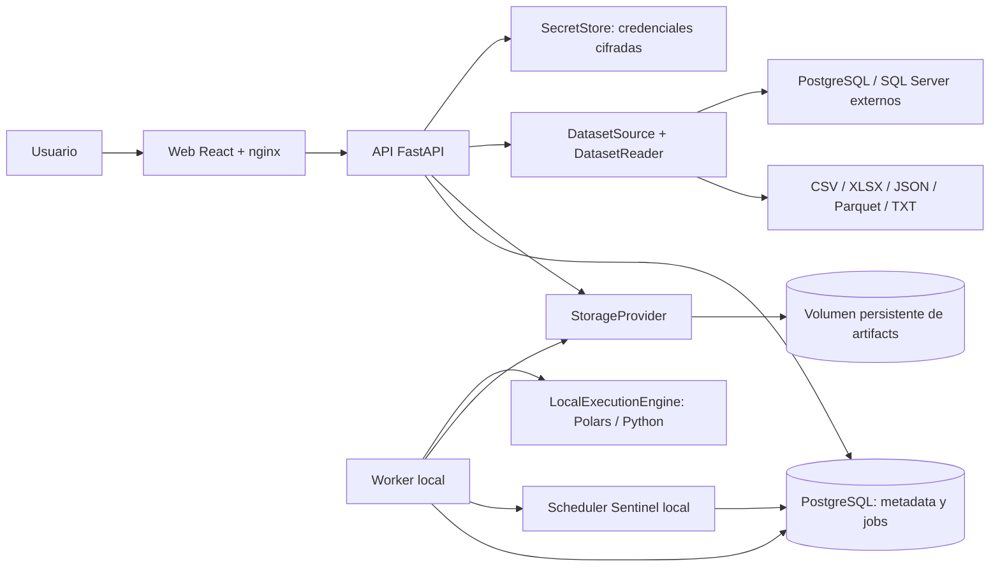

# Arquitectura local y evolución de Trackvance Core

Revisión de implementación: 0.4.1, configuración guiada por esquema, 21 de septiembre de 2026.

Trackvance es un monolito modular con una API FastAPI, una aplicación React y un
worker que comparte los modelos y servicios del backend. Docker Compose con
PostgreSQL es la instalación local principal. Las reglas y los módulos conservan
sus contratos al sustituir infraestructura mediante puertos. No se plantea dividir
el producto en microservicios para completar esta evolución.

En este documento, **implementado** significa que existe un adaptador funcional;
**preparado** indica una frontera o contrato disponible, con trabajo pendiente para
un nuevo adaptador; **objetivo** describe una capacidad futura. Los resultados de
las comprobaciones ejecutadas se registran por separado en
[validación](development/validation.md).

## Despliegue local implementado

Compose levanta `web`, `api`, `worker` y `postgres`. Solamente `web` publica un
puerto, ligado a `127.0.0.1`. La API y PostgreSQL son accesibles dentro de la red
del proyecto. Los cuatro servicios tienen `restart: "no"`: el usuario inicia
Trackvance manualmente. Una instalación nueva usa puerto 3000; la instalación
`trackvance-certification` de este equipo usa 3100.

El volumen `postgres_data` guarda metadata transaccional: organización, usuarios,
datasets y versiones, configuraciones, runs, jobs, excepciones, auditoría y
referencias de evidencia. El volumen `trackvance_data`, compartido por API y
worker, conserva archivos recibidos, Parquet canónicos, resultados, manifests y
exports. Los bytes de los archivos no se guardan en PostgreSQL. Detener o recrear
contenedores conservando sus volúmenes mantiene esas partes de la instalación.
Solo la API monta `connection_credentials` y `connection_keys`: el primero
contiene credenciales externas cifradas y el segundo su clave maestra. El worker
accede únicamente a `trackvance_data` y procesa snapshots sin recuperar secretos.
La recuperación de Conexiones requiere conservar metadata, artifacts y ambos
volúmenes de secretos de forma coordinada y con acceso restringido.

El lanzador directo con SQLite permanece como facilidad de desarrollo y pruebas.
Es una instalación separada, con su propia base y almacenamiento en `.local/`.
No representa la topología principal ni comparte datos con PostgreSQL en Compose.

## Puertos y adaptadores

| Frontera | Responsabilidad | Adaptador actual | Evolución preparada |
| --- | --- | --- | --- |
| `StorageProvider` | Publicar artifacts inmutables, leerlos, materializarlos y asignar staging temporal | `FileArtifactStore`, volumen local | S3/Azure Blob, cache local acotado y migración de locators |
| `DatasetSource` | Adquirir datos y entregar `DatasetReadResult` | Archivos locales, PostgreSQL y SQL Server | APIs, otros motores y object storage como fuentes |
| `SecretStore` | Guardar y recuperar credenciales aisladas por organización | Fernet en volumen local; clave en volumen separado | Key Vault, Secrets Manager o Vault |
| `DatasetReader` | Interpretar un formato y normalizar su estructura | CSV, XLSX, JSON/JSON Lines, Parquet, TXT/TSV | Nuevos formatos sin cambios en reglas |
| `ExecutionEngine` | Ejecutar un `Run` persistido y generar su evidencia | `LocalExecutionEngine`, Polars/Python | Adaptador de ejecución distribuida |
| `ProcessingEngine` | Compilar/evaluar expresiones portables de reglas | Compiladores Polars y DuckDB | Otros compiladores con pruebas de paridad |
| `JobQueue` | Registrar la entrega de un run para ejecución asíncrona | `DatabaseJobQueue`, consumida mediante leases | Publicación y consumo Redis/Celery |
| `NotificationDelivery` | Contrato de entrega de alertas externas | Sin adaptador; Findings internos operativos | Email, Teams, Slack o Webhook |

`ExecutionPlanner` estima memoria y disco antes de aceptar una ejecución. Elige
POLARS dentro del presupuesto local; si la carga necesita PYSPARK, devuelve
`ENGINE_UNAVAILABLE`, porque el adaptador distribuido todavía no está instalado.
DuckDB sí está implementado para compilación/paridad de reglas y lectura de
metadata Parquet, pero no ejecuta un run completo como motor seleccionable.

Las fronteras son incrementales. Algunos puertos reciben sesiones SQLAlchemy y
modelos ORM; los campos históricos `*_path` siguen almacenando locators locales.
Un adaptador remoto requiere materialización, migración de referencias y pruebas
de consistencia. Redis/Celery requiere además definir la entrega transaccional
entre el run y el mensaje. El puerto por sí solo no implementa esas garantías.
Estas limitaciones se detallan en [ADR 0006](adr/0006-architecture-ports.md).

## Responsabilidades del código

Las capas son lógicas dentro del paquete actual. Se mantienen los archivos y
contratos existentes para evitar una reorganización que rompa compatibilidad;
todavía no hay paquetes `domain/`, `application/`, `infrastructure/` y `api/`
completamente independientes.

| Responsabilidad | Archivos principales | Alcance |
| --- | --- | --- |
| API y autorización | `backend/src/trackvance/api.py`, `permissions.py` | HTTP, sesiones, CSRF, permisos y ámbito de organización |
| Aplicación | `services.py`, `dashboard.py` | Casos de uso, versiones, ejecución, excepciones y cockpit |
| Conexiones | `connections_api.py`, `connections_service.py` | Endpoints, prueba, configuración versionada, bindings, adquisición y linaje |
| Fuentes externas | `dataset_sources.py` | Adaptadores PostgreSQL/SQL Server de solo lectura, metadata, límites y representación normalizada |
| Credenciales | `credential_store.py` | Contrato `SecretStore`, cifrado local y aislamiento de credenciales por organización |
| Semántica de dominio | `config_semantics.py`, `processing.py`, `portable_engine.py`, `manifests.py` | Configuraciones declarativas, reglas, resultados y evidencia |
| Modelo persistido | `models.py`, `db.py`, `backend/migrations/` | ORM, transacciones y evolución del schema |
| Almacenamiento y entrada | `artifactstore.py`, `dataset_readers.py` | Puertos, adaptadores locales, integridad y lectura multiformato |
| Ejecución asíncrona | `execution.py`, `jobqueue.py`, `worker.py`, `planner.py` | Entrega de jobs, leases, heartbeat, presupuesto y procesamiento |
| Sentinel programado | `scheduler.py`, `sentinel_api.py` | Programaciones, revisiones, ocurrencias, despacho transaccional e histórico de series |
| Gestión de casos | `exceptions_api.py` | Responsable, prioridad, SLA, comentarios, adjuntos y filtros; validación compartida en servicios |
| Administración local | `identity_api.py` | Usuarios, roles base, permisos, contraseñas, revocación de sesiones y auditoría |
| Presentación | `frontend/src/` | Pantallas React, formularios, estados, navegación y cliente HTTP |
| Operación | `compose.yml`, `deploy/`, `scripts/`, `.github/workflows/` | Imágenes, proxy, arranque, diagnósticos y comprobaciones |

El código de aplicación solicita publicación/materialización de artifacts al
proveedor; no construye rutas desde `STORAGE_DIR`. Los paths físicos, staging y
verificación de límites permanecen en el adaptador local. Planner, heartbeat e
inicialización SQLite pueden consultar el filesystem como infraestructura local.

## Módulos funcionales y trazabilidad

| Módulo | Responsabilidad actual |
| --- | --- |
| Datasets | Inspección acotada, tipos corregibles, identificadores elegidos desde el esquema, áreas, versiones inmutables y linaje |
| Conexiones | Configuración versionada, prueba de acceso, descubrimiento SQL, preview acotado y snapshots de entrada |
| Data Intake | Contratos, catálogo de responsables, transforms con preview, reglas simples/compuestas, tipo/longitud/rango/fecha, condiciones, comparaciones e integridad referencial contra snapshots |
| ReconOps | Claves simples/compuestas con preview, transforms por lado, comparación por columna, nulls, tolerancias y agregaciones 1:N/N:1 SUM/COUNT |
| Sentinel | Selectores por esquema, schema/nulls, frescura, volumen, distinct/uniqueness, bandas median/IQR, programación local, alertas internas y series compatibles |
| Excepciones | Hallazgo/configuración, responsable, prioridad, SLA, adjuntos, reapertura, validación posterior, resolución automática opcional y cierres administrativos |
| Centro de Control | Filtros, salud, fallos, atención priorizada, tendencias y navegación a recursos |
| Auditoría e identidad | Administración local de usuarios/roles, actor estable, eventos sanitizados, sesiones, CSRF y aislamiento por organización |

Cada DatasetVersion conserva artifacts y hashes. Las configuraciones publicadas
son snapshots; modificar una configuración crea una versión. Cada run conserva
inputs, configuración efectiva, motor y evidencia. Un error técnico de ejecución
es distinto de un rechazo, diferencia o alerta de negocio. Los manifests schema 2
tienen actores estructurados y referencias completas a artifacts, con lectura
compatible de manifests v1. Los informes Excel de Intake, ReconOps y Sentinel
incluyen resumen, resultados y trazabilidad.

Una excepción conserva su hallazgo y run originales. Resolverla exige una
ejecución posterior del mismo snapshot de control que demuestre la corrección
según el módulo. El run original no cambia. Los cierres administrativos exigen
motivo y no equivalen a una resolución técnica. La política automática por caso,
apagada por defecto, aplica la misma validación desde el worker y registra actor
SYSTEM y run confirmatorio. Las reglas nuevas tienen `rule_id`: cero filas
evaluadas no demuestra corrección. Una reapertura exige evidencia posterior nueva.
En casos abiertos legacy, la identificación compatible por código/columna exige
también contadores suficientes; ausencia de Finding sin evaluación demostrable
no habilita un nuevo cierre. Los casos ya resueltos conservan su historia.

### Configuración asistida por esquema

La interfaz 0.4.1 utiliza el esquema y la muestra acotada de la DatasetVersion
seleccionada para reducir entradas libres sin cambiar los contratos del motor.
Al cargar o versionar un dataset, los identificadores se eligen desde las
columnas inspeccionadas, con selección individual o **Todos**; se eliminó la
entrada adicional de nombres que duplicaba esa decisión.

Data Intake, ReconOps y Sentinel construyen el catálogo de **Responsable** a
partir de valores ya conocidos en datasets y configuraciones del módulo. Al
crear una configuración se puede seleccionar uno existente o registrar una
etiqueta nueva. El backend continúa recibiendo y persistiendo el mismo campo
`owner`; el catálogo es una ayuda de presentación y no una nueva entidad de
identidad ni sustituye la asignación de usuarios en Excepciones.

TransformBuilder conserva los tipos persistidos `trim`, `case`,
`unicode_normalization`, `empty_to_null`, `id_padding`, `remove_characters`,
`decimal_parse` y `date_parse`, pero presenta sus nombres funcionales. La UI
calcula localmente un ejemplo y una tabla **Antes / Después** de hasta ocho
valores de la muestra real de la columna. Las transformaciones se aplican al
preview en el mismo orden visible y se pueden reordenar. Si un parseo decimal o
de fecha falla, la muestra indica **No se pudo interpretar; la transformación
conservó el valor que recibió.** Una transformación posterior de la misma cadena
puede operar sobre él. La vista previa de fecha sólo interpreta el subconjunto
determinístico que el navegador puede reproducir con certeza. Ante directivas
Python no soportadas muestra **Vista previa no disponible para este formato; la
ejecución usará el formato declarado**, sin marcar fallo ni predecir el resultado
del backend. El preview no publica artifacts, no crea DatasetVersions y no
modifica el archivo recibido.

ReconOps explica que varias columnas forman una clave compuesta ordenada. La
vista previa representa el conjunto completo de campos de origen y destino y
muestra el efecto de `trim`, `case` y `unicode_normalization` antes del cruce.
Los textos funcionales conservan `trim` como booleano, `case` como `NONE`,
`UPPER` o `LOWER` y `unicode_normalization` como `NONE`, `NFC` o `NFKC`;
configuraciones anteriores se leen sin reescritura.
Sentinel usa selectores múltiples del esquema para columnas requeridas y columnas
vigiladas por nulos. La validación final de todos estos nombres permanece en API.
Al cerrar sesión, el cliente confirma `/auth/logout`, elimina el token CSRF y la
caché de consultas, y reemplaza la ruta actual por `/`; la pantalla de inicio
vuelve a resolver la ausencia de sesión sin dejar la vista autenticada activa.

Las reglas referenciales fijan otra DatasetVersion de la organización; se cargan
por StorageProvider y se añaden al plan y manifest con sus hashes. El motor recibe
frames normalizados, nunca una conexión externa. Los transformadores de Recon
actúan antes de normalizar claves y agregar; las configuraciones nuevas no toman
arbitrariamente el primer valor no agregado de un grupo. La compatibilidad legacy
se centraliza y no reescribe snapshots ni fingerprints históricos.

El scheduler usa tres tablas: `monitor_schedules`, revisiones inmutables en
`monitor_schedule_versions` y `monitor_occurrences` enlazadas a configuración,
DatasetVersion y Run. Despacha la última versión registrada con actor SYSTEM.
Agrupa atrasos y omite solapamientos; cada decisión queda registrada. No refresca
fuentes ni añade un servicio externo. La cronología visible usa fechas previstas,
despacho e inicio real; el worker detenido implica programación detenida.

## Arquitectura local y arquitectura de producto

| Componente | Local implementado | Producto objetivo |
| --- | --- | --- |
| Despliegue | Docker Compose, cuatro servicios | Kubernetes: AKS, EKS u OpenShift; mismos límites del monolito |
| Metadata | PostgreSQL 16 en volumen | PostgreSQL administrado, políticas de disponibilidad y recuperación |
| Artifacts | `FileArtifactStore` en volumen | S3 o Azure Blob mediante `StorageProvider` |
| Fuentes | Cinco formatos de archivo, PostgreSQL y SQL Server | S3, Azure Blob, APIs y otros motores mediante `DatasetSource` |
| Procesamiento | Polars/Python; DuckDB para reglas portables | Polars y PySpark según presupuesto y capacidad instalada |
| Cola | Jobs PostgreSQL, leases, reintentos y heartbeat | Redis/Celery con entrega fiable y workers escalables |
| Identidad | Usuarios locales, roles base, contraseñas, revocación de sesiones, CSRF y RBAC | Federación OIDC/SSO y gobierno de identidad productivo |
| Secretos | Configuración local; credenciales externas cifradas con clave separada | Key Vault, Secrets Manager o Vault y rotación |
| Observabilidad | Logs, readiness, heartbeat y auditoría | OpenTelemetry, Prometheus y Grafana |
| Infraestructura | Compose y scripts operativos | Terraform, Helm y despliegues controlados |
| Entrega | Workflow de checks backend/frontend/migraciones/E2E | Controles de seguridad, dependencias e imágenes y promoción de entornos |

No se han añadido dependencias cloud al prototipo. Kubernetes, Redis/Celery,
PySpark runtime, OIDC, gestores de secretos, telemetría distribuida y Terraform/Helm
son objetivos de producto; su presencia en este mapa no significa que existan
adaptadores o despliegues certificados.

## Seguridad, operación y límites

La autorización se comprueba en backend, incluidos exports y downloads. El ámbito
de organización se conserva en metadata y artifacts. Los eventos registran actor
estable y metadata sanitizada; las opciones de lectura no deben contener tokens,
passwords ni cadenas de conexión. `.env`, almacenamiento, archivos de usuario,
backups y resultados de pruebas quedan excluidos de Git. El acceso demo es para
revisión local, se controla con `DEMO_ACCESS_ENABLED` y requiere sustitución antes
de una exposición de producto. `DEMO_SEED_ENABLED` es independiente: sólo decide
si se crean datos sintéticos durante el arranque.

La carga admite por defecto 10 MiB, 100.000 filas y 100 columnas. La inspección
previa usa hasta 100 registros cuando corresponde, o metadata embebida Parquet;
no exige un escaneo completo sólo para ofrecer las columnas. La carga/perfil
inicial permanece síncrona y acotada. Las ejecuciones de módulos pasan al worker.
La lectura XLSX/JSON y el profiling de gran volumen requieren una evolución
asíncrona antes de ampliar estos límites.

La revisión del schema actual es `0007_monitor_scheduling`, con 21 tablas de
aplicación. `0006_local_identity_exceptions` añade campos y adjuntos; `0007` añade
programaciones. Los cambios futuros requieren migraciones Alembic nuevas. Los
runbooks de arranque, reinicio, diagnóstico, reset, backup y restore están en
[operación](development/operations.md); su certificación se registra en
[validación](development/validation.md). Los ensayos destructivos sólo usan
proyectos, bases y volúmenes aislados. La recuperación de una conexión exige el
conjunto consistente PostgreSQL, artifacts, credenciales cifradas y clave.

El framework de volumen registra recursos y resultados medidos. Los límites por
defecto no aumentan porque exista un runner: sólo una medición completa puede
justificar cambiarlos en ExecutionPlanner. Un volumen rechazado por preflight o
no ejecutado por recursos no se presenta como máximo certificado. PySpark sigue
sin adaptador operativo.

La medición principal usa payload variado determinista: 106.194.531 bytes de
archivo, 50.000 filas, cuatro columnas y 79.145.600 bytes de Parquet canónico.
También adquiere snapshots PostgreSQL y SQL Server y ejecuta Intake sobre ambos.
Los tiers mayores quedaron sin ejecutar por presupuesto; el resultado no es un
límite general por tamaño. El restore aislado verificó hashes y relaciones antes
de probar la credencial PostgreSQL recuperada, refrescar y ejecutar nuevamente.
Los comandos y resultados detallados están en [ADR 0013](adr/0013-local-backup-restore.md)
y [volumen](development/volume-benchmark.md).

## Secuencia de evolución

La secuencia oficial está en [roadmap](roadmap.md): conservar Conexiones y las
fuentes PostgreSQL/SQL Server; completar Intake, ReconOps, Sentinel programado,
excepciones, administración local de usuarios, operación y benchmarks medidos.
La productización comienza sólo después de esos nueve puntos y con una nueva
autorización de alcance. Los adaptadores y despliegues cloud del mapa anterior
siguen siendo objetivos futuros, no trabajo de este ciclo.
