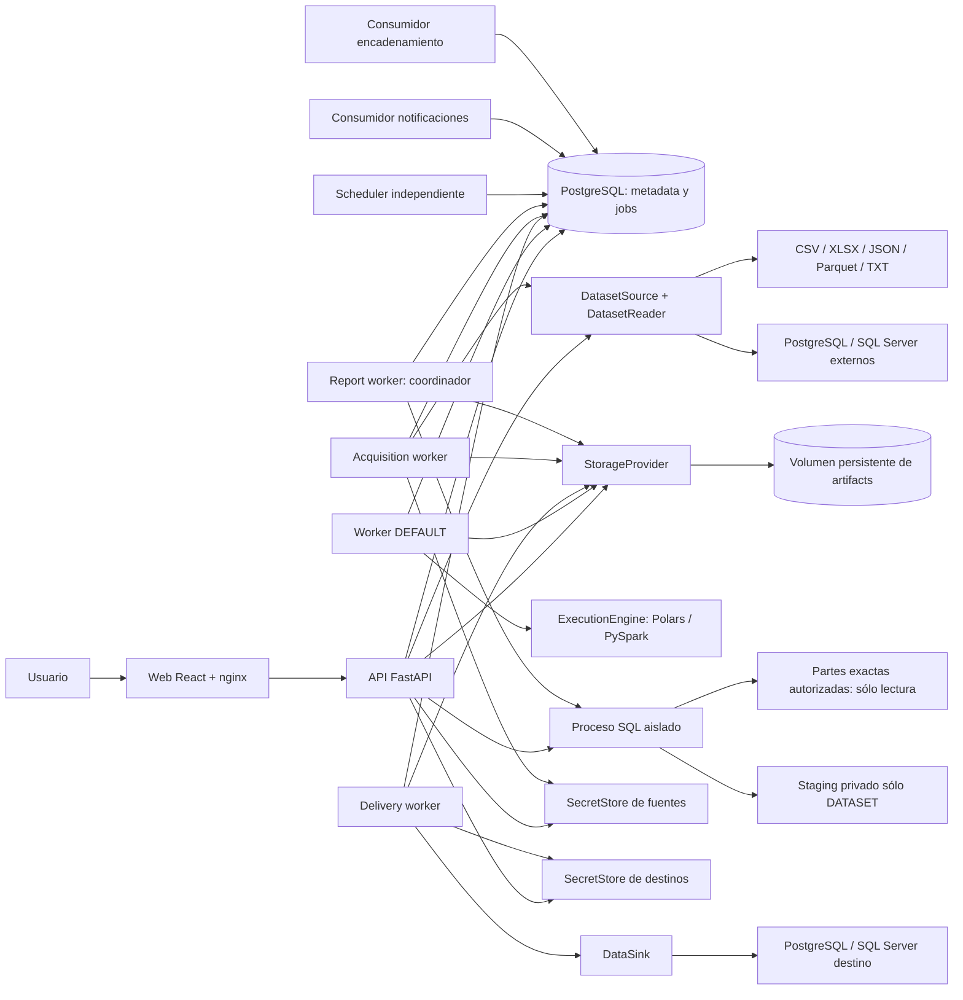

# Arquitectura local y evolución de Trackvance Core

Revisión de implementación: 0.8.0, Catálogo de gobierno y Reportes, sobre el
ciclo correctivo C01–C06, adquisición asíncrona, Spark, automatizaciones,
eventos y bandeja personal. Fecha: 5 de octubre de 2026. La certificación integrada se registra por separado;
los resultados históricos no certifican automáticamente esta revisión ni
demuestran que la instalación principal ya haya sido actualizada.

Trackvance es un monolito modular con una API FastAPI, una aplicación React y
cuatro workers, un scheduler y dos consumidores de eventos que comparten los modelos y servicios del backend. Docker Compose con
PostgreSQL es la instalación local principal. Las reglas y los módulos conservan
sus contratos al sustituir infraestructura mediante puertos. No se plantea dividir
el producto en microservicios para completar esta evolución.

En este documento, **implementado** significa que existe un adaptador funcional;
**preparado** indica una frontera o contrato disponible, con trabajo pendiente para
un nuevo adaptador; **objetivo** describe una capacidad futura. Los resultados de
las comprobaciones ejecutadas se registran por separado en
[validación](development/validation.md).

## Despliegue local implementado

```mermaid
flowchart LR
  U[Usuario] --> W[Web React + nginx]
  W --> A[API FastAPI]
  A --> P[(PostgreSQL: metadata y jobs)]
  K[Worker DEFAULT] --> P
  KD[Delivery worker] --> P
  KA[Acquisition worker] --> P
  KR[Report worker: coordinador] --> P
  SCH[Scheduler independiente] --> P
  EN[Consumidor notificaciones] --> P
  EC[Consumidor encadenamiento] --> P
  A --> S[StorageProvider]
  K --> S
  KD --> S
  KA --> S
  KR --> S
  A --> R[Proceso SQL aislado]
  KR --> R
  R --> RP[Partes exactas autorizadas: sólo lectura]
  R --> ST[Staging privado sólo DATASET]
  S --> V[(Volumen persistente de artifacts)]
  K --> E[ExecutionEngine: Polars / PySpark]
  A --> D[DatasetSource + DatasetReader]
  KA --> D
  D --> F[CSV / XLSX / JSON / Parquet / TXT]
  D --> EXT[PostgreSQL / SQL Server externos]
  A --> SEC[SecretStore de fuentes]
  KA --> SEC
  A --> DSEC[SecretStore de destinos]
  KD --> DSEC
  KD --> DS[DataSink]
  DS --> OUT[PostgreSQL / SQL Server destino]
```

Compose levanta nueve servicios: `web`, `api`, `postgres`, `worker`,
`delivery-worker`, `acquisition-worker`, `scheduler`, `events-notifications` y
`events-chaining`. Solamente `web` publica un
puerto, ligado a `127.0.0.1`. La API y PostgreSQL son accesibles dentro de la red
del proyecto. Los nueve servicios tienen `restart: "no"`: el usuario inicia
Trackvance manualmente. Una instalación nueva usa puerto 3000; la instalación
`trackvance-certification` de este equipo usa 3100.

El volumen `postgres_data` guarda metadata transaccional: organización, usuarios,
datasets y versiones, configuraciones, runs, jobs, excepciones, auditoría y
referencias de evidencia, incluidos destinos/revisiones/intentos de Delivery. El
volumen `trackvance_data`, compartido por API y procesos de aplicación, conserva archivos recibidos, Parquet canónicos, resultados, manifests y
exports. Los bytes de los archivos no se guardan en PostgreSQL. Detener o recrear
contenedores conservando sus volúmenes mantiene esas partes de la instalación.
La API monta los secretos de fuente (`connection_credentials` y
`connection_keys`) y de destino (`delivery_credentials` y `delivery_keys`). El
`acquisition-worker` monta exclusivamente los secretos de fuente. El
worker `DEFAULT` accede únicamente a `trackvance_data`; el `delivery-worker`
accede a artifacts y secretos de destino, pero nunca a los de fuente. La
recuperación requiere conservar metadata, artifacts y los cuatro volúmenes de
secretos de forma coordinada y con acceso restringido.

El lanzador directo con SQLite permanece como facilidad de desarrollo y pruebas.
Es una instalación separada, con su propia base y almacenamiento en `.local/`.
No representa la topología principal ni comparte datos con PostgreSQL en Compose.

## Puertos y adaptadores

### Catálogo y Reportes 0.8.0

Catálogo consulta metadata paginada, sin iniciar scans ni leer Parquet. Macrodominio
y dominio tienen identidad estable, organización y actividad; la clasificación
opcional de la entrada y la edición posterior no crean una DatasetVersion.
La descripción, responsables, sensibilidad y restricciones tienen historia propia.
Intake conserva la relación explícita entrada+contrato de su salida; el gobierno
actual puede heredarse y la aprobación conserva su snapshot histórico, incluso UNKNOWN.

Reportes resuelve conjuntamente todas las fuentes en una nueva transacción PostgreSQL
REPEATABLE READ. El contexto persistido incluye entrada, salida, aprobación, contrato
y revisiones admitidas, esquemas, hashes, políticas, consulta, parámetros, usuario y
organización; expira en 15 minutos. El ordinal de entrada determina la última versión
aprobada, no la fecha de reejecución. Una fuente seleccionada inelegible falla sin
retroceder a una versión más antigua. La autorización vigente se revisa al usar el
contexto y al publicar/emitir lotes; el congelado no conserva permisos revocados.

SQLGlot valida un SELECT plano completo sobre alias autorizados. La ruta guiada
genera el mismo plan; ambos admiten cruces INNER/LEFT/RIGHT/FULL de igualdad y llaves
compuestas, cardinalidad esperada/real y autorización explícita de N:M. Se rechazan
CTE, subconsultas, archivos, catálogos arbitrarios, extensiones, funciones fuera de
allowlist, DDL/DML y sentencias múltiples. DuckDB realiza la analítica en un hijo
Linux sin imports de la aplicación ni credenciales de negocio. Landlock/seccomp
permiten sólo partes exactas y runtime público de lectura, niegan red, ejecución y
procesos nuevos; threads del motor heredan las restricciones. El coordinador HTTP
o worker usa PostgreSQL, mientras el hijo recibe sólo plan y fuentes comprobadas.

PREVIEW limita la salida a 10 filas después de validar cardinalidad completa.
DOWNLOAD produce CSV/OOXML incremental con backpressure, sin spool de resultados,
Parquet de salida ni temporales. DATASET tiene Job REPORT, lease/CAS e idempotencia;
puede usar staging/spill privado y acotado. Un perfil completo y hashes de todas las
partes preceden a la publicación atómica Dataset+Version+Artifacts+linaje+JobSUCCESS.
Cada generación crea un dataset nuevo pendiente de Intake. Sus dependencias incluyen
todas las fuentes; bloqueos y autorización se propagan a las lecturas nativas y
a descendientes posteriores. Las rutas de metadata mantienen su propósito separado.

Decisiones: [ADR 0026](adr/0026-controlled-governance-strict-approval.md),
[ADR 0027](adr/0027-reports-frozen-context-sandbox.md) y
[ADR 0028](adr/0028-isolated-certification-recovery-upgrade-080.md).

| Frontera | Responsabilidad | Adaptador actual | Evolución preparada |
| --- | --- | --- | --- |
| `StorageProvider` | Publicar artifacts inmutables, verificar descriptor/partes, materializar y asignar staging temporal | `FileArtifactStore`, volumen local, Parquet multipart | S3/Azure Blob, cache local acotado y migración de locators |
| `DatasetSource` | Adquirir lotes acotados y conservar snapshots inmutables | Archivos, PostgreSQL y SQL Server; `DatasetReadResult` legacy | APIs, otros motores y object storage como fuentes |
| `DataSink` | Descubrir targets, validar permisos y publicar una DatasetVersion mediante transacción remota | PostgreSQL y SQL Server | S3/Blob/REST, warehouses u otros sinks con contratos específicos |
| `SecretStore` | Guardar y recuperar credenciales aisladas por organización | Fernet en volumen local; clave en volumen separado | Key Vault, Secrets Manager o Vault |
| `DatasetReader` | Interpretar un formato y normalizar su estructura | CSV, XLSX, JSON/JSON Lines, Parquet, TXT/TSV | Nuevos formatos sin cambios en reglas |
| `ExecutionEngine` | Ejecutar un `Run` persistido y generar su evidencia | `LocalExecutionEngine` con Polars/PySpark; `PySparkExecutionEngine` | Otros despliegues distribuidos |
| `ProcessingEngine` | Compilar/evaluar reglas y operaciones globales | Polars, PySpark con kernels portables acotados; DuckDB para paridad | Otros compiladores con pruebas de paridad |
| `JobQueue` | Registrar la entrega de un run para ejecución asíncrona | `DatabaseJobQueue`, consumida mediante leases | Publicación y consumo Redis/Celery |
| Notificaciones históricas | Conservar metadata de entregas 0.6.0 | Lectura histórica, sin envíos ni adaptador SMTP; eventos nuevos en bandeja personal independiente | Otros canales con adaptadores explícitos |
| Automatización y eventos | Despachar ocurrencias, encadenar Intake→Delivery y publicar avisos personales | Scheduler, outbox transaccional, consumidores y bandeja interna | Otros canales con adaptadores explícitos |

`ExecutionPlanner` acepta `AUTO`, `POLARS` o `PYSPARK` e incluye origen, destino y
versiones de referencia. Al encolar usa conteos y tamaños persistidos: el tamaño
del artifact para un archivo único y `canonical_size_bytes` para una población
multipart. El tamaño del descriptor no representa el tamaño de sus partes.
Si falta metadata suficiente, el plan rechaza la ejecución con
`WORKLOAD_METADATA_UNAVAILABLE`; no inventa cero bytes ni abre el descriptor
para completar el dato durante el despacho. La lectura y verificación física
corresponden a la ejecución. AUTO elige
Polars dentro del presupuesto de población materializada y Spark para cargas
mayores. Una elección explícita conserva el motor solicitado. Runtime ausente,
presupuestos insuficientes o disco insuficiente generan `FAILED_PRECONDITION`
con código persistido. Las estimaciones no sustituyen los límites del proceso.
DuckDB compila reglas para paridad y ejecuta scans globales con spill para perfil,
paginación y exportación; no es un motor seleccionable de Run.

### Ejecución Spark y memoria

La imagen fija Python 3.12, Java 17 y PySpark 4.0.3. El despliegue base usa
`local[2]`. El overlay `deploy/compose.spark-standalone.yml` añade un master y
dos executors; el driver permanece en `worker` mediante client mode, compatible
con aplicaciones Python Standalone. API y worker comparten el master y el
presupuesto para que el plan persistido describa la ejecución real. Los executors
montan sólo artifacts, nunca credenciales de fuentes o destinos.

Spark distribuye lectura, unicidad, referencias, cruces globales y escritura de
partes. Los RDD se persisten en disco. Los predicados escalares se compilan con el
kernel Polars existente en lotes de executor; esta decisión conserva Decimal
arbitrario, Unicode, condiciones y fechas sin conversión a `DECIMAL(38)` ni float.
Unicidad y referencia ordenan lookup antes de los registros aplicables y cruzan
el flujo sin buffers Python por valor repetido, incluso con una clave muy frecuente.
El runtime lo declara como `PORTABLE_POLARS_BATCH_V1`. ReconOps reparte y ordena
claves compuestas completas; cada grupo preserva filas originales y se evalúa
con la misma semántica de comparaciones y agregaciones del motor local.

Los límites predeterminados son 2.048 registros y 8 MiB por lote, 64 KiB de
contenido y margen por registro, y 10.000 registros/16 MiB por grupo ReconOps.
El perfil global aporta una cota de anchura por todas las columnas; sin esa
información histórica, Arrow lee un registro por lote. El límite se comprueba
también después de transformar. Una clave sesgada o un registro demasiado ancho
fallan con código de recursos y sin truncar resultados. Estas cotas limitan los
buffers de aplicación; Arrow/JVM, páginas Parquet y librerías conservan overhead
propio, por lo que Docker impone además límites reales de memoria/CPU.

La población y la evidencia completa se publican como Parquet multipart con
descriptor, filas, tamaños y hashes verificados. Los aceptados Intake conservan
el número original en `__tv_record_number`; esa columna interna se excluye del
esquema de negocio. El driver recibe contadores y checks acotados; la optimización
de fallos escasos admite como máximo un lote de números enteros para broadcast.
No recoge registros de negocio de la población. La paginación y el CSV completo
usan cursor acotado y spill; Excel exige sus límites explícitos de filas/celdas/bytes.

Cada Run crea una aplicación y JobGroup identificables. Un monitor comprueba
cancelación, lease, tiempo y disco; la publicación vuelve a bloquear Run y retiene
la autoridad mediante CAS del Job hasta commit. Los executors reciben snapshots
materializados y código del paquete, sin sesiones SQL ni secretos. La evidencia
registra versión, master, application ID, parámetros efectivos y presupuestos.
El histórico Sentinel consulta sólo la ventana compatible de cada métrica,
hasta 1.000 registros por regla, antes de calcular medianas y bandas exactas.
Ver [ADR 0022](adr/0022-spark-exact-bounded-execution.md) y
[medición Spark](development/spark-volume-0.7.0.md).

Las fronteras son incrementales. Algunos puertos reciben sesiones SQLAlchemy y
modelos ORM; los campos históricos `*_path` siguen almacenando locators locales.
Un adaptador remoto requiere materialización, migración de referencias y pruebas
de consistencia. Redis/Celery requiere además definir la entrega transaccional
entre el run y el mensaje. El puerto por sí solo no implementa esas garantías.
Estas limitaciones se detallan en [ADR 0006](adr/0006-architecture-ports.md).

## Responsabilidades del código

Las capas son lógicas dentro del paquete actual. Se mantienen los archivos y
contratos existentes para evitar una reorganización que rompa compatibilidad;
todavía no hay paquetes `domain/`, `application/`, `infrastructure/` y `api/`
completamente independientes.

| Responsabilidad | Archivos principales | Alcance |
| --- | --- | --- |
| API y autorización | `backend/src/trackvance/api.py`, `permissions.py` | HTTP, sesiones, CSRF, permisos y ámbito de organización |
| Aplicación | `services.py`, `dashboard.py` | Casos de uso, versiones, ejecución, excepciones y cockpit |
| Conexiones | `connections_api.py`, `connections_service.py` | Endpoints, prueba, configuración versionada, bindings, adquisición y linaje |
| Fuentes externas | `dataset_sources.py` | Adaptadores PostgreSQL/SQL Server de solo lectura, metadata, límites y representación normalizada |
| Data Delivery | `delivery_api.py`, `delivery_service.py`, `delivery_schemas.py`, `delivery_metrics.py` | Destinos/configuraciones versionados, preview, preflight, intentos, reparación local, revisiones UNKNOWN, métricas, receipt, manifest y linaje |
| Destinos externos | `data_sinks.py` | Puerto y adaptadores PostgreSQL/SQL Server, tipos, quoting, permisos, estrategias y transacción remota |
| Credenciales | `credential_store.py`, `delivery_credential_store.py` | SecretStores separados, cifrado local y aislamiento por organización/recurso |
| Semántica de dominio | `config_semantics.py`, `processing.py`, `portable_engine.py`, `manifests.py` | Configuraciones declarativas, reglas, resultados y evidencia |
| Modelo persistido | `models.py`, `db.py`, `backend/migrations/` | ORM, transacciones y evolución del schema |
| Almacenamiento y entrada | `artifactstore.py`, `dataset_readers.py` | Puertos, adaptadores locales, integridad y lectura multiformato |
| Ejecución asíncrona | `execution.py`, `jobqueue.py`, `worker.py`, `planner.py` | Entrega de jobs, leases, heartbeat, presupuesto y procesamiento |
| Spark | `spark_engine.py`, `spark_execution.py` | RDD globales, kernels acotados, materialización multipart y control de autoridad |
| Adquisición | `acquisition.py`, `acquisition_config.py`, `acquisition_errors.py`, `batch_readers.py`, `xlsx_streaming.py`, `dataset_scans.py` | Upload/snapshot asíncrono, límites efectivos, diagnóstico público, XLSX incremental, partes canónicas y perfil global exacto |
| Automatización y bandeja | `automation.py`, `dispatcher.py`, `events.py`, `notifications_api.py` | Ocurrencias IANA, encadenamiento, outbox, consumidores y avisos personales |
| Sentinel programado | `scheduler.py`, `sentinel_api.py` | Programaciones, revisiones, ocurrencias, despacho transaccional e histórico de series |
| Gestión de casos | `exceptions_api.py` | Responsable, prioridad, SLA, comentarios, adjuntos y filtros; validación compartida en servicios |
| Administración e identidad | `identity_api.py`, `permissions.py`, `sso_api.py`, `notifications.py` | RBAC persistido, catálogo, username, credencial efímera, primer acceso, OIDC, revocación y auditoría |
| Presentación | `frontend/src/` | Pantallas React, formularios, estados, navegación y cliente HTTP |
| Operación | `compose.yml`, `deploy/`, `scripts/`, `.github/workflows/` | Imágenes, proxy, arranque, diagnósticos y comprobaciones |

El código de aplicación solicita publicación/materialización de artifacts al
proveedor; no construye rutas desde `STORAGE_DIR`. Los paths físicos, staging y
verificación de límites permanecen en el adaptador local. Las comprobaciones de
capacidad y disponibilidad del runtime, los heartbeats y la inicialización
SQLite pueden consultar infraestructura local; el despacho no usa esa frontera
para abrir, hashear o escanear bytes de la población.

## Módulos funcionales y trazabilidad

| Módulo | Responsabilidad actual |
| --- | --- |
| Datasets | Inspección acotada, tipos corregibles, identificadores elegidos desde el esquema, áreas, versiones inmutables y linaje |
| Conexiones | Configuración versionada, prueba de acceso, descubrimiento SQL, preview acotado y snapshots de entrada |
| Data Intake | Contratos, catálogo de responsables, transforms con preview, reglas simples/compuestas, tipo/longitud/rango/fecha, condiciones, comparaciones e integridad referencial contra snapshots |
| ReconOps | Claves simples/compuestas con preview, transforms por lado, comparación por columna, nulls, tolerancias y agregaciones 1:N/N:1 SUM/COUNT |
| Sentinel | Selectores por esquema, schema/nulls, frescura, volumen, distinct/uniqueness, bandas median/IQR, programación local, alertas internas y series compatibles |
| Data Delivery | Destinos PostgreSQL/SQL Server, mapping tipado, preview/preflight, configuraciones inmutables, estrategias CREATE_AND_LOAD/APPEND/OVERWRITE/UPSERT, lane separada, intentos, UNKNOWN, reparación local, revisiones operativas, receipt y linaje |
| Excepciones | Hallazgo/configuración, responsable, prioridad, SLA, adjuntos, reapertura, validación posterior, resolución automática opcional y cierres administrativos |
| Centro de Control | Filtros, salud, fallos, atención priorizada, tendencias y navegación a recursos |
| Auditoría e identidad | Administración local de usuarios/roles, actor estable, eventos sanitizados, sesiones, CSRF y aislamiento por organización |

Cada DatasetVersion conserva artifacts y hashes. Las configuraciones publicadas
son snapshots; modificar una configuración crea una versión. Cada run conserva
inputs, configuración efectiva, motor y evidencia. Un error técnico de ejecución
es distinto de un rechazo, diferencia o alerta de negocio. Los manifests schema 2
tienen actores estructurados y referencias completas a artifacts, con lectura
compatible de manifests v1. Los informes Excel de Intake, ReconOps y Sentinel
incluyen resumen, resultados y trazabilidad.

Una excepción conserva su hallazgo y run originales. Resolverla exige una
ejecución posterior del mismo snapshot de control que demuestre la corrección
según el módulo. El run original no cambia. Los cierres administrativos exigen
motivo y no equivalen a una resolución técnica. La política automática por caso,
apagada por defecto, aplica la misma validación desde el worker y registra actor
SYSTEM y run confirmatorio. Las reglas nuevas tienen `rule_id`: cero filas
evaluadas no demuestra corrección. Una reapertura exige evidencia posterior nueva.
En casos abiertos legacy, la identificación compatible por código/columna exige
también contadores suficientes; ausencia de Finding sin evaluación demostrable
no habilita un nuevo cierre. Los casos ya resueltos conservan su historia.

### Configuración asistida por esquema

Desde 0.4.1, la interfaz utiliza el esquema y la muestra acotada de la DatasetVersion
seleccionada para reducir entradas libres sin cambiar los contratos del motor.
Al cargar o versionar un dataset, los identificadores se eligen desde las
columnas inspeccionadas, con selección individual o **Todos**; se eliminó la
entrada adicional de nombres que duplicaba esa decisión.

La adquisición asíncrona y la carga rápida comparten el selector de área de
negocio. Combina Operaciones, Finanzas, Logística y Ventas con los valores
existentes de la organización, ordenados y deduplicados para elegirlos sin
reescribir etiquetas históricas. **Agregar nueva área** valida entre uno y
80 caracteres y persiste el mismo `Dataset.domain`. Una nueva versión muestra
y conserva el área del dataset existente, sin sustituirla por un default.

Data Intake, ReconOps y Sentinel construyen el catálogo de **Responsable** a
partir de valores ya conocidos en datasets y configuraciones del módulo. Al
crear una configuración se puede seleccionar uno existente o registrar una
etiqueta nueva. El backend continúa recibiendo y persistiendo el mismo campo
`owner`; el catálogo es una ayuda de presentación y no una nueva entidad de
identidad ni sustituye la asignación de usuarios en Excepciones.

TransformBuilder conserva los tipos persistidos `trim`, `case`,
`unicode_normalization`, `empty_to_null`, `id_padding`, `remove_characters`,
`decimal_parse` y `date_parse`, pero presenta sus nombres funcionales. La UI
calcula localmente un ejemplo y una tabla **Antes / Después** de hasta ocho
valores de la muestra real de la columna. Las transformaciones se aplican al
preview en el mismo orden visible y se pueden reordenar. Si un parseo decimal o
de fecha falla, la muestra indica **No se pudo interpretar; la transformación
conservó el valor que recibió.** Una transformación posterior de la misma cadena
puede operar sobre él. La vista previa de fecha sólo interpreta el subconjunto
determinístico que el navegador puede reproducir con certeza. Ante directivas
Python no soportadas muestra **Vista previa no disponible para este formato; la
ejecución usará el formato declarado**, sin marcar fallo ni predecir el resultado
del backend. El preview no publica artifacts, no crea DatasetVersions y no
modifica el archivo recibido.

ReconOps explica que varias columnas forman una clave compuesta ordenada. La
vista previa representa el conjunto completo de campos de origen y destino y
muestra el efecto de `trim`, `case` y `unicode_normalization` antes del cruce.
Los textos funcionales conservan `trim` como booleano, `case` como `NONE`,
`UPPER` o `LOWER` y `unicode_normalization` como `NONE`, `NFC` o `NFKC`;
configuraciones anteriores se leen sin reescritura.
Sentinel usa selectores múltiples del esquema para columnas requeridas y columnas
vigiladas por nulos. La validación final de todos estos nombres permanece en API.
Al cerrar sesión, el cliente confirma `/auth/logout`, elimina el token CSRF y la
caché de consultas, y reemplaza la ruta actual por `/`; la pantalla de inicio
vuelve a resolver la ausencia de sesión sin dejar la vista autenticada activa.

Las reglas referenciales fijan otra DatasetVersion de la organización; se cargan
por StorageProvider y se añaden al plan y manifest con sus hashes. El motor recibe
frames normalizados, nunca una conexión externa. Los transformadores de Recon
actúan antes de normalizar claves y agregar; las configuraciones nuevas no toman
arbitrariamente el primer valor no agregado de un grupo. La compatibilidad legacy
se centraliza y no reescribe snapshots ni fingerprints históricos.

El scheduler Sentinel conserva tres tablas: `monitor_schedules`, revisiones inmutables en
`monitor_schedule_versions` y `monitor_occurrences` enlazadas a configuración,
DatasetVersion y Run. Despacha la última versión registrada con actor SYSTEM y
responsable User explícito; se revalidan permisos vigentes al despachar y ejecutar.
Agrupa atrasos y omite solapamientos; cada decisión queda registrada. No refresca
fuentes ni añade un servicio externo. La cronología visible usa fechas previstas,
despacho e inicio real. Desde 0.7.0 lo atiende `scheduler`, separado del worker.
Las automatizaciones Delivery incorporan revisiones inmutables, zona IANA,
ocurrencias idempotentes y reglas activables Intake→Delivery. Outbox y consumidores
persisten cada decisión y publican avisos internos sin SMTP.

El despacho horario, manual y encadenado resuelve exclusivamente metadata
persistida: organización, permisos actuales, publicación, aceptación Intake,
conteos, hashes registrados y revisiones. No abre un `DataSink` ni verifica
bytes canónicos. La ocurrencia y el Run congelan DatasetVersion, configuración
y destino exactos; una cadena fija `output_version_id` del Intake que la originó.
Los claims y el guard del target resuelven no repetición, solapamiento y UNKNOWN
sin un scan. Sentinel también planifica al encolar desde metadata persistida.

La UI valida el texto de zona antes de formatear o convertir; una zona vacía,
parcial o inválida muestra un error y bloquea guardar, sin fallback UTC ni zona
del navegador. Las revisiones conservan el `starts_at` histórico y `next_run_at`
si no cambia el calendario; editar un nombre no rearma un ONCE consumido.
Una creación o cambio deliberado a un nuevo inicio pasado sigue rechazado.
Si cambia el calendario con el ancla existente, se busca un próximo instante
válido futuro. Se conserva la política DST: una hora inexistente se omite y una
ambigua usa `fold=0`.

El tiempo de despacho termina al persistir Run y Job. El tiempo en cola comienza
ahí y termina al iniciar la ejecución; `DeliveryAttempt.STARTED` es la frontera
durable previa a la transacción remota. Un Job con lease RUNNING puede estar
verificando o preparando y todavía no tener un intento STARTED. Se informan
estas magnitudes por separado; un Run aún en cola tiene espera observada,
no una latencia de inicio concluida. Un scheduler independiente puede encolar
mientras Delivery está ocupado sin eliminar la espera por capacidad de workers.

### Data Delivery y confirmación remota

Data Delivery fija una DatasetVersion, una revisión inmutable de destino, target,
mapping y estrategia. Preview presenta una muestra acotada sin escribir; preflight
comprueba hash/artifact, schema, tipos, restricciones, permisos y claves, primero
al publicar y nuevamente al ejecutar. `CREATE_AND_LOAD`, `APPEND`, `OVERWRITE` y
`UPSERT` operan dentro de una transacción del motor remoto. No existe una
transacción distribuida entre PostgreSQL interno y el destino.

Cada job Delivery, incluido preflight persistido, usa la lane `DELIVERY`;
adquisición usa `ACQUISITION` y calidad usa `DEFAULT`. Los heartbeats por lane
permiten diagnosticar los tres procesos. El scheduler corre de forma independiente. Un
`DeliveryAttempt` iniciado termina `COMMITTED`, `FAILED` o `UNKNOWN`. `UNKNOWN`
preserva una confirmación de commit perdida o un intento recuperado sin prueba:
no se reinterpreta ni se reintenta automáticamente. El receipt sólo existe tras
commit confirmado; el manifest/linaje conectan Run, DatasetVersion,
DestinationVersion, intento y artifacts sin incluir secretos o filas completas.

El mapping conserva el tipo lógico de la DatasetVersion; no convierte STRING en
número, fecha, timestamp o booleano. Toda materialización técnica compatible se
congela como `PreparedDelivery` y un `PreparedRows` sellado antes de `STARTED`.
El worker compara las identidades congeladas, verifica descriptor, todas las
partes, tamaños, hashes, esquema y conteos, y verifica de nuevo la fuente después
de preparar el spool. `StorageProvider.dataset_paths` mantiene su contrato
completo para todos los consumidores; no hay bypass global ni caché que permita
reutilizar una verificación anterior de bytes modificables.

Las lecturas y scans costosos ocurren fuera de transacciones de metadata largas;
los heartbeats conservan una sesión independiente. Antes de STARTED se revalidan
identidad, autorización vigente, lease, cancelación y exclusión por target bajo
el fence final. Un artifact desaparecido o corrupto tras encolar produce
`FAILED_PRECONDITION` antes de DDL/DML: no se sustituye su SHA esperado ni se
elige otra versión. La cancelación durante una llamada indivisible de hash se
observa al retornar esa llamada. El claim condicional del job ocurre antes de reconciliar y respeta el
orden Run→Job, compartido con cancelación. Un estado remoto conocido prevalece
sobre una cancelación posterior; un lease perdido sin prueba no autoriza replay.
Las tablas existentes se bloquean aun con cero filas. PostgreSQL revalida bajo
lock la constraint UPSERT nombrada y rechaza RLS activa para `OVERWRITE`. SQL
Server rechaza `IGNORE_DUP_KEY`; `OVERWRITE` exige visibilidad de metadata de
seguridad y rechaza FILTER policies que pudieran ocultar filas al `DELETE`.
Los staging de claves replican tipos/collations nativos; PostgreSQL usa
`ON CONFLICT ON CONSTRAINT`, mientras SQL Server evita `MERGE`, obtiene el conteo
con `SELECT @@ROWCOUNT` y falla si una clave coincide con más de una fila.
`STRING` usa longitud UTF-16/Unicode variable exacto; `TIMESTAMP`, offset y hasta
seis dígitos fraccionales (precisión de microsegundos). Si la evidencia local
falla tras commit, el Run conserva estado `SUCCESS` y decisión `COMMITTED`, con
`PENDING_REPAIR`, sin repetir la transacción.

Desde 0.5.1, `POST /delivery/runs/{run_id}/repair-evidence` reconstruye receipt y
manifest únicamente a partir de referencias persistidas y verificadas. Exige
Run `SUCCESS / COMMITTED`, intento confirmado, configuración/revisión de destino
y artifact canónico íntegro. No obtiene credenciales ni invoca `DataSink`. La
operación reutiliza evidencia válida, evita vínculos duplicados y sólo retira
`PENDING_REPAIR` al materializar ambos artifacts verificables; un fallo mantiene
la confirmación remota y registra auditoría. Es recuperación local, no replay.

La entidad `DeliveryReview`, persistida en `delivery_reviews`, añade observaciones
append-only de un resultado `UNKNOWN`: intento, revisor estable y nombre snapshot,
fecha de verificación externa, fecha de registro, nota y resultado. Los resultados
son `REMOTE_COMMIT_OBSERVED`, `REMOTE_NOT_COMMITTED_OBSERVED` e `INCONCLUSIVE`.
`GET/POST /delivery/runs/{run_id}/reviews` consulta o añade esa evidencia sin
cambiar la Run o el DeliveryAttempt, sin publicar un receipt de commit confirmado
y sin crear otra Run. El operador verifica fuera de Trackvance; guardar su nota
no convierte una observación humana en confirmación transaccional del sistema.

La semántica aditiva `metric_semantics` distingue filas preparadas
(`rows_attempted`), filas fuente enviadas en una operación confirmada
(`rows_written`) y acciones de inserción/actualización reportadas por el adaptador
(`rows_inserted`, `rows_updated`). `bytes_sent` mide valores preparados no nulos
codificados en UTF-8, no bytes del protocolo de red. Ninguno de estos campos es
un censo físico final del destino: triggers/rules/policies pueden alterar sus
efectos. Un conteo desconocido sigue `null` y se presenta `N/D`, no cero.

PostgreSQL 18+ distingue las acciones UPSERT con el `OLD` documentado de
`RETURNING WITH`; suma resultados de los lotes y no cuenta acciones suprimidas
por un trigger `BEFORE`. PostgreSQL 16/17 conserva `null / null` cuando
`ON CONFLICT` puede actualizar. UPSERT sólo-claves con `DO NOTHING` sí conoce
inserciones afectadas y cero actualizaciones; el payload vacío tiene ceros
conocidos. No se usan estadísticas aproximadas, lecturas previas susceptibles a
carreras ni el campo interno `xmax`. Estos conteos no incluyen acciones ajenas
efectuadas por triggers/rules.

Los vínculos canónicos separan relación de tipo de entidad; la revisión no
reescribe historia para corregir la documentación:

| Origen | Relación | Destino |
| --- | --- | --- |
| `DATASET_VERSION` | `DELIVERY_INPUT` | `RUN` |
| `RUN` | `DELIVERED_TO` | `DELIVERY_DESTINATION_VERSION` |
| `RUN` | `DELIVERY_RECEIPT` | `ARTIFACT` (receipt) |
| `ARTIFACT` (receipt) | `EVIDENCE_OF` | `DELIVERY_ATTEMPT` |

0.6.0 sustituye los permisos reutilizados de 0.5.1 por Delivery/Destinos
granulares. Reparar y revisar exigen delivery:repair_evidence y
delivery:review_unknown; sobrescribir/alterar tienen permisos separados.
Organización y CSRF continúan siendo obligatorios. Una DeliveryTargetPolicy
persistida vuelve irreversible la auditoría fechaIngesta/usuario por fingerprint
físico. La publicación fija policy y Configuration juntas; ALTER y DML ocurren
en la misma transacción remota. No se modifica DatasetVersion ni se implementa
SHIST. Ver [ADR 0019](adr/0019-delivery-target-audit.md) y
[detalle funcional/técnico](development/delivery-audit.md).

### Identidad 0.6.1 y compatibilidad de notificaciones

User.role_id referencia Role; RolePermission asigna códigos del catálogo del
producto. Cada petición resuelve permisos vigentes; las rutas desconocidas
fallan cerrado. Administrator usa system_key protegido y catálogo completo;
users:manage/roles:manage no son delegables. Las bajas son lógicas y serializadas
por organización; el último administrador y roles con usuarios quedan protegidos.
La UI refresca /me y role_version sin logout al cambiar sólo permisos.

Username/email autentican localmente. Alta y regeneración generan una temporal
de 24 horas y sólo persisten Argon2. El envelope UserCredentialIssueResponse
devuelve la credencial una vez al administrador con Cache-Control: no-store;
UserResponse y GET nunca la contienen. La UI usa estado transitorio del modal,
sin MutationCache ni persistencia, y lo libera al cerrar o desmontar.

Primer acceso exige nueva contraseña, también tras login Microsoft/Google. SSO
usa Authlib/joserfc, Code Flow, PKCE y validación de tokens; ExternalIdentity
resuelve provider/issuer/subject. Microsoft y Google están deshabilitados por
defecto y no son requisitos de la operación local. Sus variables y secretos se
mantienen separados de los backups.

En 0.6.0 NotificationService intentaba enviar la temporal por SMTP; 0.6.1 retira
ese flujo y el adaptador. notification_deliveries, sus filas y 0011 se conservan
para lectura histórica y recuperación. No se crea una entrega ni un evento de
envío al administrar usuarios. 0.7.0 añade avisos operativos en una bandeja
personal mediante outbox; la credencial temporal sigue visible una sola vez y
no se envía por ese canal. Ver [identidad](development/identity-060.md).

La bandeja admite filtros Todas, Leídas y Sin leer. Los setters individuales
`POST /notifications/inbox/{id}/read` y `/unread` fijan un estado explícito;
`unread` establece `read_at=null` idempotentemente. Exigen el destinatario,
organización, `notifications:read` y los permisos actuales del recurso enlazado,
también para administradores. La UI actualiza lista, filtros y contador al
confirmar; recarga y reinicio conservan el estado. Cambiar lectura no crea otro
Run, evento outbox, entrega ni auditoría ficticia de negocio.

### Carga diferida de la interfaz

El shell autenticado conserva navegación, sesión, cabecera y pie mientras
React.lazy carga Dashboard, Datasets, Conexiones, módulos, Delivery u Operaciones.
`RouteContent` contiene Suspense con loader accesible y un error boundary con
recarga explícita; navegar a otra ruta reinicia el boundary. El detalle Delivery
se importa aparte desde el detalle genérico de Run, sin arrastrar su builder.
La autorización permanece en componentes y backend; diferir un módulo no otorga
permisos. Vite genera chunks y CSS asociados sin dependencias nuevas ni un umbral
de warning artificialmente aumentado. En la medición histórica 0.5.1, el entry JS baja de 611.407 a
364.966 bytes; esto no mide latencia ni el total de cada ruta. Ver
[resultados y pruebas](development/code-splitting-results-0.5.1.md).

## Arquitectura local y arquitectura de producto

| Componente | Local implementado | Producto objetivo |
| --- | --- | --- |
| Despliegue | Docker Compose, nueve servicios; overlay Spark Standalone opcional | Kubernetes: AKS, EKS u OpenShift; mismos límites del monolito |
| Metadata | PostgreSQL 16 en volumen | PostgreSQL administrado, políticas de disponibilidad y recuperación |
| Artifacts | `FileArtifactStore` en volumen | S3 o Azure Blob mediante `StorageProvider` |
| Fuentes | Cinco formatos de archivo, PostgreSQL y SQL Server | S3, Azure Blob, APIs y otros motores mediante `DatasetSource` |
| Destinos | PostgreSQL y SQL Server mediante `DataSink`; escritura transaccional controlada | S3/Blob/REST, warehouses y otros sinks con gobierno productivo |
| Procesamiento | Polars y PySpark Local/Standalone; DuckDB para reglas y scans acotados | Nuevos despliegues según presupuesto y capacidad instalada |
| Cola | Jobs PostgreSQL, leases, reintentos y heartbeat | Redis/Celery con entrega fiable y workers escalables |
| Identidad | RBAC dinámico, usuarios locales, primer acceso y OIDC Microsoft/Google | Gobierno ampliado, grupos/dominios y directorio multi-organización |
| Secretos | Stores y claves separados para fuentes y destinos | Key Vault, Secrets Manager o Vault y rotación |
| Observabilidad | Logs, readiness, heartbeat y auditoría | OpenTelemetry, Prometheus y Grafana |
| Infraestructura | Compose y scripts operativos | Terraform, Helm y despliegues controlados |
| Entrega | Workflow de checks backend/frontend/migraciones/E2E | Controles de seguridad, dependencias e imágenes y promoción de entornos |

No se han añadido dependencias cloud al prototipo. Kubernetes, Redis/Celery,
gestores de secretos cloud, telemetría distribuida y Terraform/Helm
son objetivos de producto; su presencia en este mapa no significa que existan
adaptadores o despliegues certificados.

## Seguridad, operación y límites

La autorización se comprueba en backend, incluidos exports y downloads. El ámbito
de organización se conserva en metadata y artifacts. Los eventos registran actor
estable y metadata sanitizada; las opciones de lectura no deben contener tokens,
passwords ni cadenas de conexión. `.env`, almacenamiento, archivos de usuario,
backups y resultados de pruebas quedan excluidos de Git. El acceso demo es para
revisión local, se controla con `DEMO_ACCESS_ENABLED` y requiere sustitución antes
de una exposición de producto. `DEMO_SEED_ENABLED` es independiente: sólo decide
si se crean datos sintéticos durante el arranque.

La adquisición asíncrona incremental admite por defecto 1 GiB de archivo, 5.000.000 de filas,
100 columnas y 2 GiB observados; los lotes se limitan a 5.000 filas/8 MiB y
el perfil usa 256 MiB con spill. CSV, TXT, JSON Lines, Parquet y snapshots SQL
se consumen incrementalmente. XLSX usa un lector ZIP/OOXML incremental:
1.000.000 de registros de datos, 1 GiB comprimido y 4 GiB expandidos por defecto,
sin precargar hoja ni shared strings completos. SAX procesa chunks de 64 KiB;
shared strings y fórmulas compartidas usan índices SQLite privados y cachés
acotadas. El parser rechaza macros, DTD/entidades y miembros/rutas inválidos;
comprueba expansión real, disco, tiempo, cancelación y lease durante la lectura.
JSON no lineal conserva 10 MiB/100.000 filas y la ruta síncrona histórica conserva
sus mismos límites. La inspección
previa usa hasta 100 registros cuando corresponde, o metadata embebida Parquet;
no exige un escaneo completo sólo para ofrecer las columnas. El upload/snapshot
nuevo pasa a ACQUISITION y el perfil se publica tras verificar la población
completa. Las ejecuciones de calidad pasan a DEFAULT.

La inspección XLSX aplica presupuestos independientes de metadata/muestra y
puede devolver `inspection_limited` y un total desconocido. No escanea la hoja
completa en HTTP para contar registros. La primera fila no vacía es encabezado;
filas sólo formateadas no son datos y dimensiones declaradas no son un censo.
Se preservan hoja, encabezado físico, espacios, Unicode, identificadores,
fórmulas como texto, fechas/epoch y numeración original. Inferencia y perfil
abarcan toda la población y la publicación conserva el fence transaccional;
un fallo no publica una muestra ni una versión parcial.

Excel admite 1.048.576 filas físicas por hoja incluyendo encabezado. La cota
efectiva es el mínimo del presupuesto general, el XLSX y el espacio restante
desde el encabezado. No se anuncian cinco millones de filas XLSX ni se amplían
los límites de exportación Excel. Los trece parámetros XLSX y las cotas de
columnas/celdas/lotes/recursos se describen en
[operación](development/operations.md) y se consultan con
`GET /api/v1/acquisitions/limits?format=XLSX&route=ASYNC_ACQUISITION`.
El descriptor del backend evita duplicar constantes en la UI.

Los fallos nuevos conservan código, mensaje público, detalles del límite y
referencia diagnóstica. Se distinguen filas, archivo comprimido, expansión,
celda/registro, columnas, hoja, estructura, formato, tiempo, disco, memoria y
permisos. Sólo excepciones legacy reconocidas tienen un mapeo seguro; el fallback
no expone valores, paths privados, trazas ni credenciales. API, historial y
notificaciones derivan la misma causa pública. Un contador cero durante
indexación no significa fuente vacía; bytes recibidos, valores materializados
y versión publicada son contadores distintos. Los errores históricos no se
reescriben ni reciben una causa retrospectiva inventada.

Data Delivery trabaja con la DatasetVersion canónica registrada y conserva los
límites de columnas del prototipo. El preflight diagnostica incompatibilidades;
la transacción vuelve a resolver y bloquear el target y revalida las condiciones
críticas antes del DML. Las cuentas de destino deben aplicar privilegio mínimo
por estrategia; PostgreSQL UPSERT requiere `TEMPORARY`. SQL Server exige `SELECT`
para targets existentes, `OVERWRITE` requiere además `VIEW DEFINITION` y UPSERT
depende de la política de `tempdb` para su tabla temporal.
`UNKNOWN` requiere
verificación operativa; repetir a ciegas puede duplicar o reemplazar datos.

La revisión histórica 0.5.1 terminaba en `0009_delivery_reviews`, con 25 tablas de
aplicación. `0007` añade programaciones; `0008` crea destinos, revisiones e intentos
de entrega y agrega `jobs.lane`; `0009` sólo añade revisiones operativas
`delivery_reviews`. Las migraciones 0001–0008 no se reescriben. Los cambios futuros
requieren migraciones Alembic nuevas. 0.6.0 agrega 0010/0011/0012 y seis tablas:
roles, role_permissions, external_identities, oidc_login_attempts,
notification_deliveries y delivery_target_policies. Los
runbooks de arranque, reinicio, diagnóstico, reset, backup y restore están en
[operación](development/operations.md); su certificación se registra en
[validación](development/validation.md). Los ensayos destructivos sólo usan
proyectos, bases y volúmenes aislados. La recuperación exige el conjunto
consistente PostgreSQL, artifacts, credenciales/clave de fuentes y
credenciales/clave de destinos.

La certificación histórica 0.5.0 restauró backups 0.4.1 manifest 1/state 2/0007:
preservó la proyección exacta de 21 tablas, migró a 24 tablas/0008, dejó Delivery
vacío y asignó lane DEFAULT a los jobs históricos. En 0.5.1 el restore llega a
25 tablas/0009; los backups anteriores empiezan sin revisiones UNKNOWN y los
backups nuevos deben recuperarlas íntegramente. La recertificación de ambos
orígenes se informa en validación y no se deduce del ensayo histórico.
En 0.6.0 y 0.6.1 el destino histórico es 0012/state 5 con 31 tablas; se compara el estado nativo
completo o las proyecciones legacy-v4/v3/v2 según la versión real del origen.
En el ciclo 0.6.1 se ejecutaron nuevamente el drill nativo y las restauraciones
auténticas desde 0.6.0 y 0.5.1. Las restauraciones desde 0.4.1 y 0.5.0 son
antecedentes del ciclo 0.6.0. [Operaciones](development/operations.md) enlaza
ambos grupos con su procedencia explícita.
El staging de backup verifica
tamaño/hash antes de consumir cada copia para impedir sustituciones TOCTOU.
State 2 no incluía hash estructural del catálogo; esa limitación histórica se
conserva explícita.

El framework de volumen registra recursos y resultados medidos. Los límites por
defecto no aumentan porque exista un runner: sólo una medición completa puede
justificar cambiarlos en ExecutionPlanner. Un volumen rechazado por preflight o
no ejecutado por recursos no se presenta como máximo certificado. La medición
histórica de la publicación inicial 0.7.0 ejercitó PySpark Local y Standalone con
un millón de filas en Intake, ReconOps y Sentinel; documentó recursos y límites
por separado. Llegó a 0015/state 6 con 42 tablas, multipart y outbox. No certifica
automáticamente el ciclo C01–C06. La corrección añade únicamente
`0016_acquisition_diagnostics` y usa state 7: conserva las mismas 42 tablas y
agrega dos columnas nullable de diagnóstico a AcquisitionRun, sin reescribir
errores ni otras filas.

La recuperación de un origen 0015/state 6 exige `snapshot-legacy-v6` exactamente
igual: sólo se proyectan fuera `error_details` y `error_reference` cuando son
NULL. Se preservan todas las filas históricas, incluida actividad asíncrona,
errores anteriores, áreas, opciones, numeración, límites, `read_at`, artifacts
y linaje. Un valor no NULL, tabla/columna desconocida, FK divergente o cambio
en otro campo impide la prueba. Los orígenes state 2–5 siguen sus proyecciones
explícitas, encadenadas tras esta comprobación; para state 5 las tablas agregadas
en 0.7.0 deben seguir vacías. Ver
[ADR 0021](adr/0021-v070-state-compatibility.md) y
[ADR 0025](adr/0025-corrections-c01-c06.md).

La medición histórica 0.4.0 usó payload variado determinista: 106.194.531 bytes de
archivo, 50.000 filas, cuatro columnas y 79.145.600 bytes de Parquet canónico.
También adquiere snapshots PostgreSQL y SQL Server y ejecuta Intake sobre ambos.
Los tiers mayores quedaron sin ejecutar por presupuesto; el resultado no es un
límite general por tamaño. El restore aislado verificó hashes y relaciones antes
de probar la credencial PostgreSQL recuperada, refrescar y ejecutar nuevamente.
Los comandos y resultados detallados están en [ADR 0013](adr/0013-local-backup-restore.md)
y [volumen](development/volume-benchmark.md). La recertificación 0.5.1 repite un
smoke general acotado y mide Delivery por separado; no hereda el PASS de 100 MiB.

## Secuencia de evolución

La secuencia oficial está en [roadmap](roadmap.md): conservar Conexiones y las
fuentes PostgreSQL/SQL Server; completar Intake, ReconOps, Sentinel programado,
excepciones, administración local de usuarios, operación, benchmarks medidos y
Data Delivery SQL controlado. La productización comienza después de esos diez
puntos y con una nueva
autorización de alcance. Los adaptadores y despliegues cloud del mapa anterior
siguen siendo objetivos futuros, no trabajo de este ciclo.
