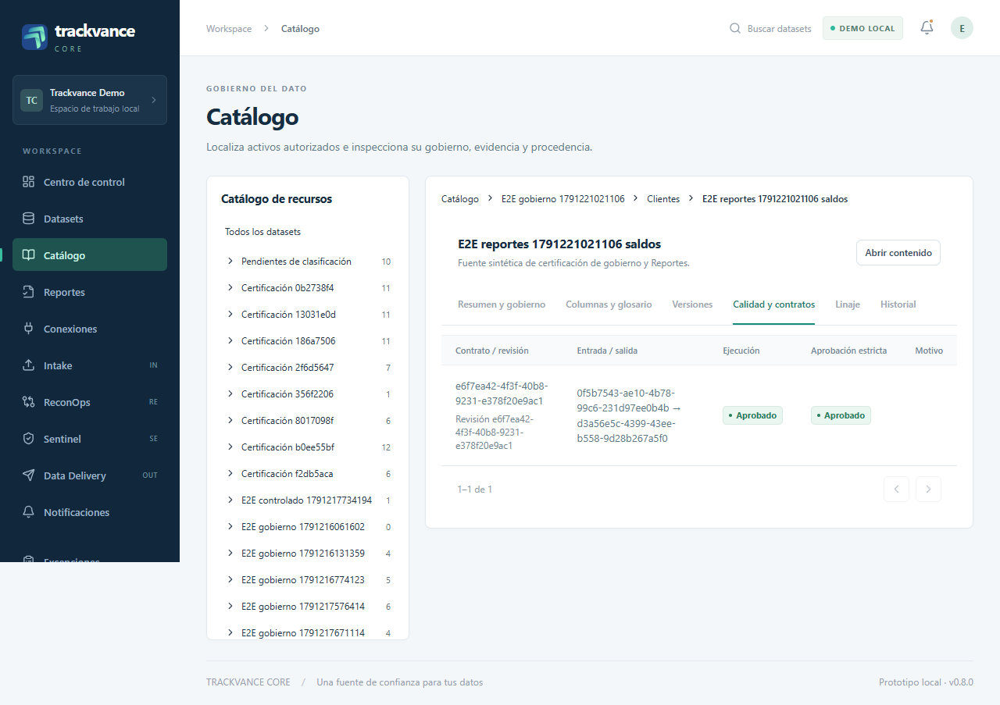
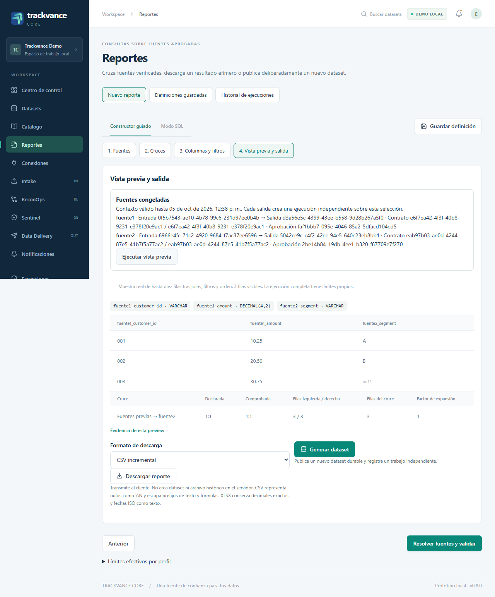
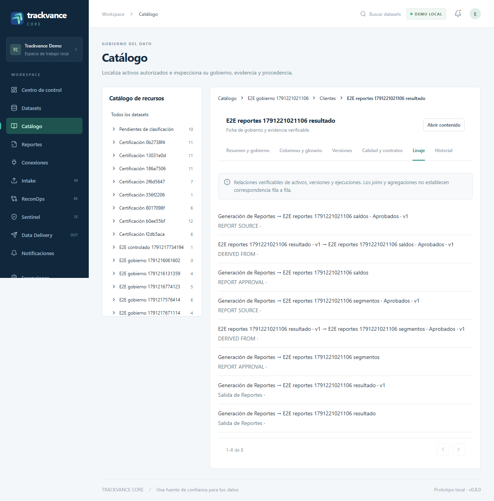

# Catálogo y Reportes: guía de uso 0.8.0

Esta guía describe los controles reales de la aplicación. El acceso y las acciones disponibles dependen de los permisos del usuario. Asignar responsables a un dataset no les concede acceso.

## Cargar y clasificar

En **Datasets → Cargar dataset**, una carga por archivo puede dejar vacíos **Macrodominio** y **Dominio**. La adquisición y sus validaciones conservan su funcionamiento habitual. Los mismos selectores opcionales aparecen al registrar una fuente externa desde **Conexiones**. El dominio depende del macrodominio elegido: cambiar el padre limpia la selección del hijo. Las identidades existentes se seleccionan por nombre; crear una entidad compartida requiere `domains:manage` y confirmación en el diálogo.

Una nueva versión de un dataset existente conserva la clasificación vigente de ese activo. El área histórica aparece como dato de solo lectura. Para clasificar posteriormente una carga pendiente, abra **Catálogo → ficha del dataset → Resumen y gobierno → Editar gobierno**. Guarde macrodominio, dominio, descripción funcional, responsables, clasificación de información y criticidad. Esta operación modifica la metadata y registra su historia; conserva los identificadores de las versiones y las aprobaciones anteriores. Un conflicto de revisión exige actualizar la ficha antes de volver a guardar.

Una clasificación completa necesita macrodominio y dominio activos y relacionados. Desactivar una entidad conserva su asociación histórica, pero impide su selección nueva y afecta la habilitación actual del recurso. El editor identifica los valores inactivos conservados; puede actualizar otras propiedades sin reclasificar ni retirar responsables históricos. Las asignaciones nuevas requieren identidades activas. Los términos de glosario ya asociados también se conservan si se desactivan y pueden retirarse explícitamente.

## Explorar evidencia en el Catálogo

**Catálogo** muestra un árbol de macrodominios, dominios y tipos de recursos. Cada rama se consulta al expandirla y pagina sus resultados. La lista mantiene búsqueda, tipo de recurso, estado, responsable y paginación en la URL; seleccionar una rama acota la lista. **Pendientes de clasificación** agrupa activos incompletos o asociados a entidades inactivas.

La ficha del dataset dispone de seis secciones con enlaces directos:

| Sección | Uso |
| --- | --- |
| Resumen y gobierno | Inspeccionar la clasificación vigente, responsables y evaluación actual; administrar bloqueos con permiso. |
| Columnas y glosario | Consultar el esquema registrado, documentar columnas de una versión y asociar términos al dataset. |
| Versiones | Abrir el perfil y la evidencia de una versión específica. |
| Calidad y contratos | Revisar contrato, revisión, ejecución, entrada, salida y evidencia de aprobación estricta. |
| Linaje | Seguir relaciones de activos, versiones, configuraciones, ejecuciones y reportes. |
| Historial | Revisar cambios de gobierno y sus identidades históricas. |

Por ejemplo, `/catalog/datasets/{id}?section=columns&version_id={version_id}` abre la documentación del esquema exacto. La documentación no cambia tipos físicos ni se traslada silenciosamente a columnas de otro esquema. Los términos compartidos se administran en **Administración y glosario**; retirar una asociación no elimina el término.

La aprobación estricta es evidencia histórica de una ejecución Intake. La habilitación para Reportes combina esa evidencia con clasificación activa, disponibilidad y restricciones actuales. Una ejecución antigua con etiqueta aprobada puede carecer de evidencia suficiente. Clasificar un activo tampoco aprueba su contenido. La ficha separa estas evaluaciones y muestra motivos; la integridad completa de los bytes se vuelve a comprobar al ejecutar.

## Construir un reporte

Abra **Reportes → Nuevo reporte**. El constructor tiene cuatro etapas:

1. **Fuentes:** busque datasets y contratos, revise motivos de inhabilitación y añada fuentes elegibles. Cada fuente tiene un alias, un contrato fijo, revisiones explícitamente admitidas y una política de entrada: última aprobada o versión específica. “Última” se refiere a la entrada aprobada más reciente bajo las revisiones admitidas. La consulta usa la salida canónica de esa aprobación.
2. **Cruces:** conecte la fuente base con las demás mediante `INNER`, `LEFT`, `RIGHT` o `FULL`. Declare llaves simples o compuestas y cardinalidad `1:1`, `1:N`, `N:1` o `N:M`. Autorizar `N:M` requiere una elección explícita y sigue sujeto a límites de expansión. La cardinalidad observada se calcula después de los filtros previos, sobre las fuentes completas.
3. **Columnas y filtros:** seleccione columnas, nombres y orden del resultado, filtros previos por fuente, filtros posteriores y un orden reproducible. Los grupos permiten `AND` y `OR`. El modo SQL utiliza únicamente los alias congelados y parámetros tipados como `$cliente`. Esta versión admite el subconjunto SQL autorizado; no admite CTE, subconsultas ni `SELECT *`. Cambiar de modo conserva los controles y exige volver a resolver.
4. **Vista previa y salida:** pulse **Resolver fuentes y validar**. Revise las versiones, revisiones y ejecuciones de aprobación congeladas, advertencias y vencimiento del contexto. Después ejecute la vista previa cuando su rol tenga permiso. La muestra contiene como máximo diez filas y conserva identificadores textuales, decimales exactos, nulos y textos vacíos como valores distintos.

Cambiar la consulta, fuentes, alias, parámetros o filtros invalida el contexto y la muestra. Una discrepancia de cardinalidad, una fuente inválida o un SQL inválido requiere corrección. Cuando la vista previa falla exclusivamente por límites de recursos, la pantalla puede permitir la generación durable con el mismo contexto; el trabajo vuelve a ejecutar todos los controles antes de publicar. Una muestra exitosa no garantiza que una salida completa termine dentro de sus límites. La tabla **Límites efectivos por perfil** informa los límites de configuración, separados de los volúmenes certificados.

## Descargar, generar y guardar

Las tres acciones tienen efectos independientes:

| Acción | Resultado |
| --- | --- |
| Descargar reporte | Transfiere CSV o XLSX al navegador y registra una ejecución. No publica un dataset ni conserva un archivo de resultado en el servidor. |
| Generar dataset | Registra un trabajo durable y publica un nuevo activo únicamente cuando el resultado completo termina correctamente. |
| Guardar definición | Conserva la definición reutilizable y sus revisiones; no ejecuta, descarga ni publica el resultado. |

La descarga CSV representa un nulo con `\N`, escapa prefijos de texto de forma reversible y protege celdas que parecen fórmulas. XLSX conserva decimales exactos y fechas ISO como texto. **Cancelar transferencia** interrumpe la recepción del navegador; la pantalla distingue recepción completa de guardado local. Los permisos `reports:download` y `reports:generate` son independientes de `reports:preview`; un usuario autorizado puede resolver y ejecutar su salida sin permiso de muestra.

**Generar dataset** pide nombre, descripción y clasificación propia opcional. El trabajo muestra etapa, progreso, métricas, estado y diagnóstico. Solo una publicación completa crea el activo visible. Un resultado generado muestra origen **Reportes**, su descriptor y Parquet canónico, linaje de las fuentes congeladas y restricciones heredadas. Requiere una aprobación Intake propia antes de emplearse como una nueva fuente aprobada de Reportes. **Validar con Intake** abre la configuración con el dataset seleccionado; no ejecuta un contrato automáticamente.

En **Definiciones guardadas**, abrir permite consultar o ejecutar según permisos. Duplicar crea un borrador independiente; guardar una definición existente crea una nueva revisión con control de concurrencia. **Historial de ejecuciones** separa los perfiles de vista previa, descarga y generación y ofrece enlaces profundos al trabajo y al dataset publicado.

El historial de una definición se consulta por páginas. Sus enlaces abren la revisión exacta, también cuando son enlaces de linaje; una revisión ausente o no autorizada produce un error. Abrir una revisión antigua no cambia la vigente. Guardar desde esa revisión crea una nueva revisión y verifica que nadie haya modificado la definición mientras tanto. La preferencia CSV/XLSX se guarda con la revisión y se restaura al abrirla.

Las tarjetas de fuente ofrecen páginas de revisiones del contrato y de versiones de entrada cuando la historia supera cien elementos. Cambiar de página conserva las revisiones admitidas y la versión elegida; no admite revisiones nuevas automáticamente. La selección de fuentes y la resolución siguen siendo acciones distintas.

## Evidencia de navegador

El recorrido automatizado `frontend/tests-e2e/catalog-reports.spec.ts` usa API, PostgreSQL, trabajadores y navegador reales. Verifica dos cargas sin clasificación, clasificación posterior sin nueva versión, dos aprobaciones estrictas, un `LEFT JOIN`, valores textuales `001` y `003`, nulos, descarga CSV, generación completa, linaje, nueva aprobación y reutilización posterior. También verifica navegación por teclado, métricas de publicación, selección de la revisión histórica exacta, preferencias de descarga, concurrencia al guardar una nueva revisión y edición de metadata que conserva un dominio inactivo. Las capturas se generan con datos sintéticos de ese recorrido. El gate publica únicamente un resumen saneado y tres PNG; las trazas y archivos de diagnóstico permanecen privados.

La [validación local del frontend](evidence/0.8.0/frontend/validation.json) registra 252 pruebas aprobadas, TypeScript, lint, compilación y un recorrido real aprobado sin omisiones ni reintentos. El [resumen de navegador](evidence/0.8.0/frontend/browser-summary.json) conserva fecha, duración y hashes; el [historial saneado](evidence/0.8.0/frontend/attempt-history.json) distingue fallos anteriores corregidos del resultado final.

La ficha de calidad muestra la ejecución, el contrato y las versiones exactas de entrada y salida:

La vista previa mantiene `001`, `002`, `003`, decimales exactos y un nulo; descarga y publicación son acciones separadas:

El dataset publicado conserva relaciones de fuente, aprobación, versión y ejecución; la pantalla identifica el alcance del linaje:

El resultado de una ejecución se acredita en su evidencia de certificación. Esta guía por sí sola no acredita que el recorrido ni GitHub Actions hayan finalizado correctamente.
