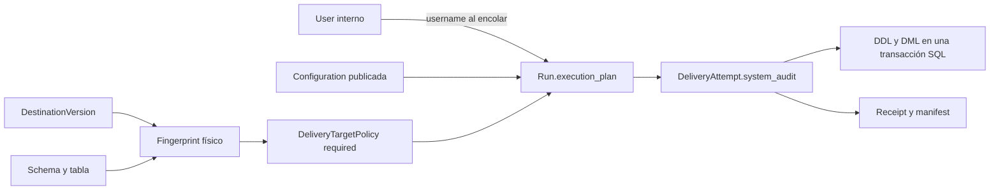
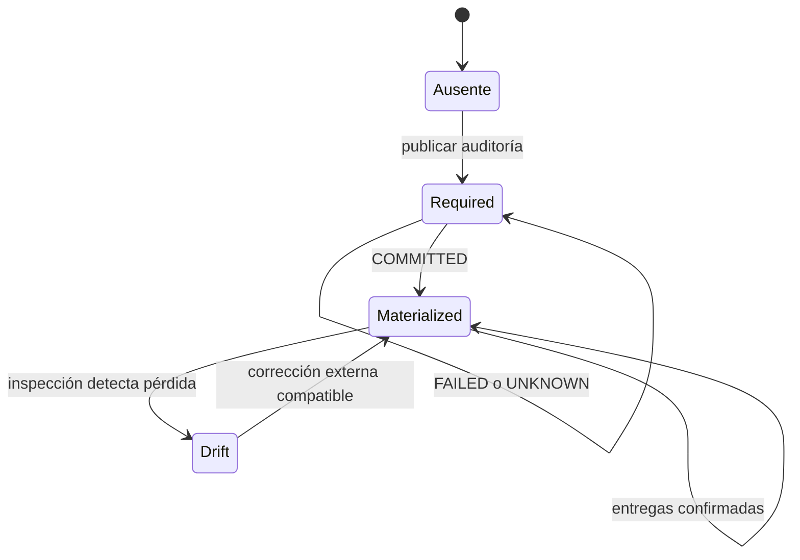

# Data Delivery: fechaIngesta y usuario — implementación 0.6.0

## Cambio funcional respecto a 0.5.1

Data Delivery ya publicaba DatasetVersion inmutables a PostgreSQL y SQL Server,
con destinos versionados, mapping técnico, cuatro estrategias y evidencia de
cada intento. La tabla receptora no permitía atribuir una fila a su última
ingesta Trackvance. 0.6.0 agrega una opción conjunta de auditoría de publicación
y una obligación persistente por target. Los datos de negocio no se transforman
ni se modifican en origen. No se implementan SHIST, tablas históricas paralelas,
SCD, fechaDesde/fechaHasta ni detección histórica de cambios.

El riesgo de una simple opción en Configuration sería que otra configuración
publicara sobre la misma tabla sin auditoría o que una rotación de credenciales
hiciera desaparecer el requisito. La solución introduce DeliveryTargetPolicy,
independiente de revisiones del destino y de credenciales. Otro riesgo era
atribuir retroactivamente la fecha de habilitación a registros previos: las
columnas agregadas a tablas existentes son nullable, sin default.

## Uso del builder

1. Elegir DatasetVersion y destino, con la revisión correspondiente.
2. Seleccionar schema/tabla existente o solicitar tabla nueva.
3. Activar **Incluir campos de auditoría de Trackvance**.
4. Revisar el mapping de negocio. `fechaIngesta` y `usuario` quedan reservadas y
   no aceptan valores del mapping. No se solicita username al operador.
5. Ejecutar preflight. Sobre tabla existente debe haber metadata compatible y,
   si falta alguna columna, permiso ALTER remoto.
6. Publicar. Desde ese momento el target queda obligado a usar ambas columnas,
   incluso si la primera Run no se ejecuta o falla.
7. Ejecutar una Run con la DatasetVersion publicada. El worker vuelve a comprobar
   el target y ejecuta DDL/DML juntos cuando corresponde.

Si la política ya existe, el builder muestra ambas columnas activadas y bloquea
su deshabilitación con el texto: «Esta tabla utiliza auditoría de ingesta de
Trackvance. Todas las entregas posteriores deben registrar fechaIngesta y usuario».
La API también rechaza drafts manipulados; ocultar un checkbox no es autorización.

## Qué significan las columnas

| Campo | Valor | Momento de captura |
|---|---|---|
| fechaIngesta | Un timestamp UTC por DeliveryAttempt, hasta seis dígitos fraccionales (microsegundos) | Preparación local del intento, antes de STARTED |
| usuario | Username interno del User que encoló la Run | Creación de la Run, snapshot inmutable |

Una cuenta que entra por Microsoft o Google conserva exactamente el username
asignado en Trackvance. No se usan display name, email, subject externo ni usuario
de conexión SQL. Si después se renombra el User, la Run conserva su snapshot.
Los timestamps corresponden al intento de ingesta, no al instante de commit SQL
ni a la fecha de creación original del registro de negocio.

| Estrategia | Efecto de auditoría |
|---|---|
| CREATE_AND_LOAD | Cada fila insertada recibe timestamp y username del intento |
| APPEND | Sólo las filas nuevas reciben valores; filas previas quedan intactas |
| OVERWRITE | DELETE e INSERT transaccionales; todas las filas resultantes reciben valores |
| UPSERT INSERT | La nueva fila recibe ambos valores |
| UPSERT UPDATE | La fila coincidente actualiza también ambos valores |

Por tanto, estas columnas representan la **última ingesta Trackvance** que tocó
la fila. Un actor externo todavía puede escribir en una tabla administrada por
su organización; Trackvance no instala triggers globales ni intercepta cambios
externos. La garantía de auditoría se aplica a sus propias entregas.

## Esquemas y compatibilidad de tipos

| Motor | Columna temporal creada | Columna de actor creada |
|---|---|---|
| PostgreSQL | `"fechaIngesta" TIMESTAMPTZ(6)` | `"usuario" VARCHAR(128)` |
| SQL Server | `[fechaIngesta] DATETIMEOFFSET(6)` | `[usuario] NVARCHAR(128)` |

Para CREATE_TABLE las dos son NOT NULL. Para una tabla existente, el ALTER
declara explícitamente NULL y omite DEFAULT. No se ejecuta un UPDATE de backfill.
Una fila previa permanece NULL/NULL salvo que la propia estrategia la actualice
o sustituya: por ejemplo, UPSERT UPDATE registra correctamente la nueva ingesta.

Se adoptan columnas existentes compatibles. El campo temporal debe preservar
zona/offset y al menos seis dígitos de precisión fraccional (microsegundos). El campo usuario debe ser Unicode/string
variable con capacidad mínima de 128, o sin límite. Identidades y campos
generated no se consideran escribibles. Si falta una sola columna, se crea esa
columna; si una existente es incompatible, no se cambia su tipo, no se renombra
y no se elimina/recrea la tabla.

PostgreSQL exige identidad exacta del nombre citado. Una columna `fechaingesta`
creada sin comillas no se adopta silenciosamente como `fechaIngesta`. SQL Server
compara nombres de auditoría de forma insensible a mayúsculas, conserva el nombre
real descubierto para DML y rechaza coincidencias ambiguas. El mapping de negocio
se conserva con los contratos estrictos de tipos de 0.5.1.

## Modelo persistente y migración

`0012_delivery_target_audit` es aditiva y sucede a `0011_notification_delivery`.
No modifica migraciones históricas. Agrega `delivery_target_policies` y
`delivery_attempts.system_audit` JSON. Los intentos históricos reciben `{}`; no
se inventan usernames ni timestamps retrospectivos.

La política contiene identidad estable, organización, destino inicial,
fingerprint único por organización, motor, host, puerto, base, schema, tabla,
`audit_columns_required=true`, habilitador user ID/username y fechas de
habilitación/materialización/creación. La restricción CHECK impide false y no
hay endpoint de deshabilitación o borrado. El User se conserva con baja lógica,
de forma que el habilitador y las Runs siguen teniendo identidad histórica.

La huella se deriva de JSON canónico de organización/motor/host/puerto/base/
schema/tabla. No incluye password, username SQL, secret_reference ni TLS.
Normaliza host DNS e IP; conserva el case de identificadores PostgreSQL. Para
SQL Server aplica casefold de base/schema/tabla conservadoramente: aliases de
mayúsculas no evaden la política, pero dos tablas distintas sólo por mayúsculas
en un servidor case-sensitive comparten obligación. Aliases DNS diferentes no
se resuelven como un único servidor físico automáticamente. Ese límite del
locator configurado requiere gobierno de conexiones, no acceso a credenciales.



## Fronteras transaccionales y permisos

Publicación serializa por fingerprint en PostgreSQL mediante advisory lock de
transacción, incluyendo la ausencia de fila, y persiste Configuration y policy
juntas. El unique constraint añade defensa. El preflight no cambia el target.
El worker persiste STARTED antes de la operación remota de escritura, como en
0.5.1; el preflight previo sólo consulta metadata y permisos del destino.

El adaptador prepara y valida valores localmente. Para una tabla existente toma
lock remoto y vuelve a consultar columnas antes de ALTER/DML. PostgreSQL utiliza
ACCESS EXCLUSIVE en entregas auditadas; SQL Server usa el lock transaccional
TABLOCKX/HOLDLOCK existente. Un cambio incompatible entre preflight y escritura
se rechaza. Agregar campos y escribir filas comparten commit/rollback. No se abre
una transacción DDL independiente previa, ni existe transacción distribuida con
la metadata de Trackvance.

| Acción | Permiso Trackvance adicional | Privilegio SQL |
|---|---|---|
| Publicar/encolar CREATE_TABLE | delivery:alter_target | CREATE TABLE y schema según selección |
| Activar auditoría sin materialización confirmada | delivery:alter_target | ALTER si falta alguna columna |
| OVERWRITE | delivery:overwrite | Privilegios de la estrategia y visibilidad de metadata |
| Entrega auditada ya materializada | Permisos ordinarios de configuración/ejecución | Privilegios de estrategia; campos deben existir |

La dependencia RBAC no convierte delivery:execute en permiso de ALTER. Los
permisos se comprueban en backend; ser dueño de una conexión o poder leer su
metadata tampoco equivale a poder administrar roles. El administrador del target
debe otorgar privilegios SQL apropiados. PostgreSQL ALTER requiere ownership
efectivo/superusuario; SQL Server consulta HAS_PERMS_BY_NAME para ALTER.

## Drift, fallos y estado UNKNOWN

| Estado observado | Respuesta |
|---|---|
| Policy ausente, auditoría false | Comportamiento compatible con 0.5.1 |
| Policy required, draft false | AUDIT_COLUMNS_REQUIRED |
| Falta columna, nunca se confirmó materialización | Puede agregarse dentro de la nueva entrega deliberada |
| Falta columna tras materialización confirmada | AUDIT_COLUMNS_DRIFT; no recreación automática |
| Tipo externo incompatible | AUDIT_COLUMNS_INCOMPATIBLE; intervención explícita |
| Mapping intenta escribir campo técnico | AUDIT_MAPPING_COLLISION |
| ALTER remoto insuficiente | FAILED_PRECONDITION con check AUDIT_ALTER_PERMISSION |
| Commit remoto no confirmado | UNKNOWN; policy requerida, materialización no afirmada |

UNKNOWN sigue siendo evidencia de incertidumbre, no prueba de rollback ni de
commit. El intento no se reintenta automáticamente al reiniciar. Su snapshot
conserva timestamp y username, pero `columns_created` permanece null porque no
se conoce el resultado confirmado. Una nueva Run deliberada inspecciona el
target; si adopta campos compatibles y confirma su propio commit, marca policy
materialized sin reescribir el intento UNKNOWN anterior.



## Contratos y evidencia

El nuevo GET `/api/v1/delivery/destinations/{id}/target-policy` recibe
schema_name/table_name y destination_version_id opcional. Permite consultar
policy antes de crear una tabla; no abre conexión SQL ni necesita secretos.
Devuelve audit_columns_required, policy_id, materialized_at y target_fingerprint.
Se aplica scope de organización y delivery:read.

DeliveryDraft agrega audit_columns_enabled; preflight devuelve system_audit con
enabled, policy_id, nombres reales, campos faltantes y materialized_at. Intentos,
receipt y sección delivery del manifest incluyen un snapshot consistente:

```json
{
  "enabled": true,
  "fecha_ingesta": "2026-09-26T12:34:56.123456+00:00",
  "username": "operador.interno",
  "policy_id": "uuid-policy",
  "columns": {"fecha_ingesta": "fechaIngesta", "usuario": "usuario"},
  "columns_created": true
}
```

COMMITTED y materialized se persisten antes de publicar archivos locales. Un
fallo de ArtifactStore no provoca replay; reparación local conserva los valores
persistidos y verifica su consistencia con Run/Attempt. Configuraciones históricas
sin el nuevo flag mantienen sus hashes canónicos y no se reescriben manifests
para agregar campos. El linaje añade AUDITED_TARGET entre Run y policy.

La auditoría registra DELIVERY_TARGET_AUDIT_ENABLED,
DELIVERY_TARGET_AUDIT_COLUMNS_CREATED y DELIVERY_TARGET_AUDIT_DRIFT. La metadata
permitida incluye IDs y fingerprint, nunca credenciales SQL/SMTP/SSO, bodies de
notificaciones, tokens ni datos de negocio completos.

## Backup/restore, pruebas y límites

Backups incluyen política y snapshots de intentos en la misma base de metadata,
junto con roles, usuarios y artifacts. `.env` continúa fuera del archivo; SMTP y
secretos de cliente SSO siguen configurándose externamente. Un restore debe
conservar el requisito incluso si el destino configurado rota su password.
El downgrade controlado de metadata no borra columnas en servidores externos.

Las pruebas de unidad/API comprueban fingerprint, publicación atómica, rechazo
de deshabilitación, tipos, permisos, snapshots, evidencia, UNKNOWN y rollback.
El runner `scripts/tests/delivery_cycle.py` usa proyectos/volúmenes exclusivos,
PostgreSQL y SQL Server reales, Mailpit y OIDC firmado desechable en overlays.
Certifica CREATE con/sin auditoría, APPEND, OVERWRITE, UPSERT INSERT/UPDATE,
históricos NULL, adopción parcial/completa, ALTER denegado, mapping reservado,
drift, receipt/manifest, usuarios local/Microsoft/Google y restart.

La prueba UNKNOWN hace commit real y pierde deliberadamente el acknowledgement
del adaptador; su nombre y evidencia declaran la simulación. No certifica un
fallo de red físico ni a Google/Microsoft reales. El resultado ejecutado de cada
matriz queda en `docs/development/evidence/0.6.0/`; este documento describe casos,
no convierte escenarios preparados en PASS. Los providers reales requieren
credenciales externas y su estado se informa por separado.

No se agregan scheduling Delivery, nuevos DataSink, SHIST, masking, retención
avanzada ni gestores empresariales de secretos. Los límites de volumen y
métricas de 0.5.1 siguen vigentes: rows_written mide filas fuente enviadas en un
commit confirmado, no un inventario remoto post-trigger. La inspección y locks
protegen nuestras transacciones; los cambios fuera de Trackvance pertenecen al
gobierno del target.
