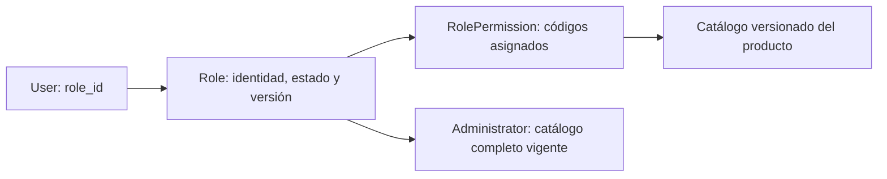
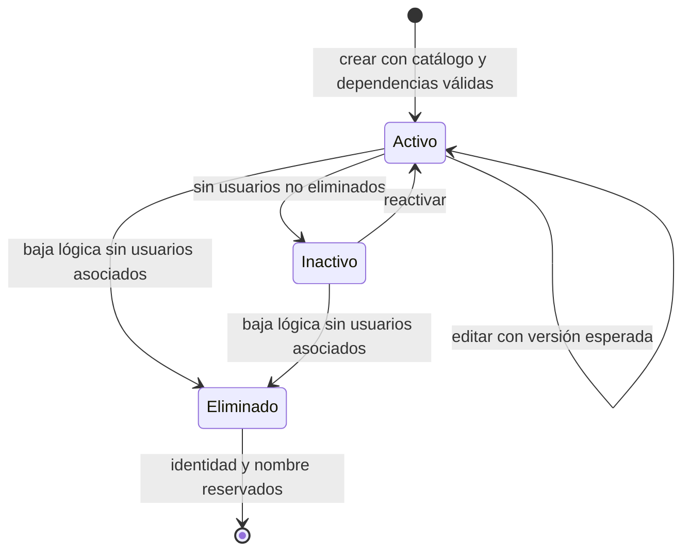
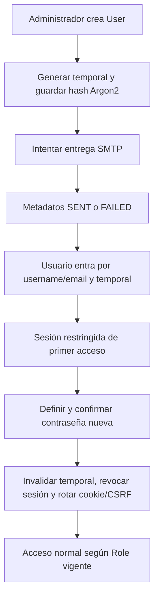

# Identidad, autorización y notificaciones 0.6.0

Este documento describe la implementación; los resultados ejecutados se registran
en `validation.md` y `evidence/0.6.0`. Una capacidad implementada no equivale a una
prueba real de Microsoft/Google. Los ensayos externos sin credenciales conservan
`NOT_RUN_EXTERNAL_CREDENTIALS`.

## RBAC dinámico y catálogo del producto

En 0.5.1 cada usuario contenía una etiqueta de rol y `permissions.py` resolvía un
diccionario estático. Cambiar accesos exigía un release; el cliente podía retener
permisos hasta cerrar sesión y una ruta desconocida recibía `runs:read`. En 0.6.0
la relación persistida es User.role_id → Role → RolePermission. La etiqueta
histórica `User.role` se conserva por compatibilidad de almacenamiento, pero no
autoriza peticiones. La API devuelve el nombre vigente desde Role.

El catálogo de códigos pertenece al producto, versionado junto con la matriz de
rutas. No hay API para inventar códigos. Un rol configura un subconjunto de ese
catálogo. Incluye Datasets, Conexiones, Intake, ReconOps, Sentinel, Delivery,
Destinos, Excepciones, Reglas, exports, artifacts, Auditoría, Usuarios, Roles,
Notificaciones, Sistema y las vistas transversales de Runs. Los permisos de
consulta, configuración, ejecución, sobrescritura, ALTER, revisión y reparación
se distinguen. Las rutas compartidas de Runs deben validar además el módulo del
recurso consultado: un permiso transversal nunca debe abrir datos de un módulo
que el rol no puede consultar.



El backend valida dependencias transitivas. Por ejemplo, sobrescribir exige
ejecutar y consultar Delivery; alterar exige ejecutar; administrar destinos
exige consultarlos. La UI puede completar esas dependencias, pero una petición
manipulada que las omita recibe error. `users:manage` y `roles:manage` son
exclusivos de Administrator: no pueden asignarse a un rol custom, aunque los
solicite un administrador. Resolver permisos siempre vuelve a intersectar con
el catálogo y a excluir capacidades no delegables de los roles ordinarios.

Administrator se reconoce por `system_key=ADMINISTRATOR`, no por el texto visible.
Es permanente: no se elimina, desactiva, renombra ni pierde permisos. Obtiene el
catálogo completo en cada resolución; no conserva una copia que envejezca con
las versiones. Las mutaciones de usuarios se serializan por organización para
evitar que dos administradores se desactiven simultáneamente dejando cero
administradores activos. La baja o degradación del último administrador se
rechaza, igual que una eliminación propia que comprometa la administración.

La migración crea Administrator, Data Owner / Lead, Data Analyst, Operations y
Auditor por organización. `Data Owner` histórico pasa a referenciar el rol
equivalente. Se conservan los accesos funcionales anteriores mediante permisos
granulares; no se reescriben actores, auditorías ni configuraciones históricas.
Las semillas son sólo valores iniciales: nunca se reaplican sobre un rol que ya
ha sido administrado. Los roles desconocidos heredados fallan cerrado.



Un usuario desactivado sigue bloqueando la baja de su rol; un usuario eliminado
lógicamente deja de bloquearla. El nombre normalizado continúa reservado después
de eliminar el rol. La versión esperada evita sobrescribir una edición
concurrente. El número de usuarios que muestra la UI cuenta asociaciones no
eliminadas, independientemente del estado activo.

La sesión identifica al usuario; no almacena permisos autoritativos. Cada petición
valida usuario activo/no eliminado, rol vigente y organización. Cambiar permisos
afecta la siguiente petición sin recrear usuarios. `/me` entrega `role_version`
y permisos vigentes; el frontend refresca periódicamente, al recuperar foco y
ante un 403. Puede existir un intervalo breve de presentación desactualizada,
pero la API ya aplica la revocación. Cambiar el rol de un usuario revoca todas
sus sesiones y exige autenticarse de nuevo.

```mermaid
sequenceDiagram
    participant B as Navegador
    participant A as API
    participant D as PostgreSQL
    B->>A: petición con cookie HttpOnly
    A->>D: sesión y User vigente
    A->>D: Role y permisos actuales
    A->>A: ruta explícita + permiso + organización
    A-->>B: respuesta o 403; ruta desconocida denegada
    B->>A: GET /me periódico o al recuperar foco
    A-->>B: permisos y role_version actuales
```

Las APIs de roles permiten listar/buscar, consultar catálogo, crear, editar y
eliminar lógicamente. Configuración presenta permisos agrupados y explica la
protección de Administrator. Los eventos ROLE_CREATED, ROLE_UPDATED,
ROLE_PERMISSIONS_CHANGED, ROLE_DISABLED y ROLE_DELETED fijan actor, organización,
identidad y cambio; no guardan credenciales. La matriz explícita de endpoints se
mantiene junto al contrato y se contrasta con las rutas instaladas por FastAPI.

## Usuarios y acceso local

El formulario de alta requiere nombres, apellidos, username, email, rol y estado.
Los nombres/apellidos heredados siguen nulos hasta una edición explícita; no se
deducen a partir de un display name. Para usuarios nuevos, `name` es la unión de
nombres y apellidos. Username acepta 3 a 80 caracteres ASCII entre letras,
números, punto, guion bajo y guion. Se normaliza para unicidad global sin importar
mayúsculas; el email también se compara normalizado. Las cuentas eliminadas no
liberan esos identificadores.

La migración obtiene una base determinista del email y resuelve colisiones de
forma ordenada y reproducible. El username nuevo sirve para login y futuras
entregas; no reemplaza el actor almacenado en auditorías anteriores. Un cambio
posterior de username no cambia el snapshot de una Run ya encolada.

La pantalla acepta usuario o correo con contraseña. El error de login es
genérico para no confirmar si existe una cuenta. La autenticación local sigue
disponible cuando SSO y SMTP están deshabilitados. La API de alta no acepta una
contraseña elegida por el administrador: genera una credencial criptográfica de
al menos 20 caracteres, guarda únicamente Argon2 y establece cambio obligatorio
con expiración a 24 horas. El plaintext vive en memoria durante el envío SMTP;
no aparece en DTOs, frontend administrativo, auditoría, logs ni tabla de entregas.



Si SMTP falla, el usuario permanece creado y se muestra el estado de entrega.
Regenerar y reenviar crea otra contraseña, sustituye el hash, renueva la
expiración, reactiva la obligación y revoca sesiones. No recupera la credencial
anterior ni permite verla al administrador. La operación necesita versión
esperada; su evento no contiene el password ni su hash.

Una sesión con `must_change_password=true` únicamente puede usar `/me`, logout y
el cambio de primer acceso. No puede consultar Datasets, publicar Delivery ni
invocar endpoints indirectos. La contraseña definitiva tiene mínimo 12
caracteres y no puede coincidir con la temporal vigente. Tras el cambio se
actualiza `password_changed_at`, se limpia la expiración y se emite una sesión
nueva con CSRF nuevo. Las sesiones antiguas dejan de autorizar peticiones.

Desactivar fija active=false y revoca sesiones. Eliminar fija deleted=true,
active=false y deleted_at, conservando FKs e historia. La UI presenta username,
nombre, correo, rol, estado, último acceso y métodos vinculados. USER_CREATED,
USER_UPDATED, USER_ROLE_CHANGED, USER_DISABLED, USER_DELETED,
USER_CREDENTIALS_REGENERATED y USER_PASSWORD_CHANGED permiten investigar cambios
sin registrar material secreto.

## SSO: Microsoft y Google autentican; Trackvance autoriza

SSO no crea cuentas. El administrador debe preprovisionar User y elegir su rol.
El primer enlace exige un identificador cuya autoridad haya validado el
proveedor, coincidente con esa cuenta existente. Después se resuelve únicamente
por provider + issuer + subject. Un cambio de email externo no reasigna la
identidad ni puede transferirla a otra cuenta. ExternalIdentity tiene una clave
única global y vínculo estable a User; no contiene access tokens, refresh
tokens, ID tokens ni client secrets.

El flujo es server-side Authorization Code con PKCE S256, state aleatorio,
nonce y binding al navegador. Un intento efímero tiene expiración y consumo
único. El callback consume el intento, intercambia el code y valida firma,
algoritmo, issuer, audience, expiración y nonce mediante bibliotecas JOSE/OAuth
mantenidas. El secreto de cliente sólo sale hacia el token endpoint esperado.
La URL final es local y controlada, sin un `return_to` arbitrario. La sesión
resultante usa la cookie HttpOnly normal de Trackvance.

Microsoft usa discovery de la autoridad common y la App Registration debe
aceptar directorios organizacionales y cuentas personales mediante
AzureADandPersonalMicrosoftAccount. La validación enlaza tenant, issuer y clave
de firma; common no significa aceptar cualquier issuer. Outlook/Hotmail/Live y
cuentas work/school están dentro del flujo. Un email/preferred_username por sí
solo no prueba propiedad suficiente para enlazar desde un tenant arbitrario:
el backend aplica la política de autoridad documentada en la guía de SSO.
La redirect URI se registra como Web y sin query parameters.

Google admite Gmail y Workspace. El primer enlace exige email_verified=true y
correo Gmail, o Workspace con `hd` adecuado. Una cuenta Google basada en un
correo externo sin esa autoridad se rechaza para enlace automático incluso si
Google marcó el email como verificado tiempo atrás. Después del enlace se usa
issuer/sub, no el email. No se solicita Gmail API, Microsoft Graph, calendarios
ni scopes de escritura: únicamente openid, profile y email.

SSO como primer acceso no elimina la obligación de contraseña local. Si User
todavía conserva una temporal, el login externo válido crea una sesión
restringida y obliga a definir una contraseña local nueva. Sólo completar ese
paso invalida definitivamente la temporal. Así todas las cuentas mantienen un
método local en 0.6.0 sin dejar contraseñas de incorporación activas indefinidamente.

Usuarios desactivados/eliminados no pueden acceder por ningún proveedor. Roles y
permisos continúan resolviéndose en Trackvance; claims de grupos, directorios o
roles externos nunca elevan privilegios. Un Administrator puede desvincular la
identidad externa desde Métodos de acceso sin borrar User. Los eventos SSO_LINKED,
SSO_UNLINKED, SSO_LOGIN_SUCCESS y SSO_LOGIN_FAILED se sanitizan. Se excluyen query
strings del access log para impedir almacenar códigos OAuth.

Los proveedores deshabilitados o incompletos no muestran botón y no bloquean el
arranque ni readiness. `/auth/providers` sólo expone estado público. Discovery,
JWKS y token exchange se hacen durante autenticación, no como requisito de
salud de workers. El modo de proveedor falso exige un indicador explícito de
test y vive en un overlay desechable; no está habilitado en Compose base.

## Notificaciones reutilizables

En 0.5.1 había una frontera preparada sin transporte operativo. En 0.6.0
NotificationService recibe el evento/template y delega un mensaje efímero en el
puerto NotificationDelivery. SMTPNotificationDelivery implementa EMAIL. El
primer template funcional es USER_TEMPORARY_CREDENTIALS: nombre, username,
contraseña temporal, expiración, URL de Trackvance y avisos de cambio y seguridad.

NotificationDeliveryRecord guarda organización, tipo de evento, template,
canal, recipient_type, user_id, email snapshot, provider_key, número de intento,
estado PENDING/SENT/FAILED, error_code y fechas. No guarda subject/body que
contengan contraseña, hashes Argon2, cabeceras Authorization ni credenciales
SMTP. El estado PENDING se confirma antes de enviar; una interrupción del
proceso puede dejarlo pendiente. Recuperarse exige una regeneración explícita:
no existe una cola que pueda reenviar un cuerpo secreto persistido.

SMTP acepta STARTTLS y SSL/TLS con validación de certificados; NONE requiere
habilitación explícita de entorno local/test. Errores de autenticación, conexión
o configuración se convierten en códigos controlados. La ausencia de proveedor
produce FAILED/NO_PROVIDER y no interrumpe el arranque. Configuración muestra
remitente y estado, nunca usuario/password SMTP o secretos OAuth.

El destinatario operativo es USER. El puerto y los metadatos están preparados
para futuros resolutores USER/USERS/ROLE/DOMAIN/GROUP, pero no se implementan
envíos masivos ni resolución de grupos en este release. Tampoco se envían aún
RUN_COMPLETED, DELIVERY_FAILED, DELIVERY_UNKNOWN o SENTINEL_ALERT. Añadir esos
eventos reutilizará este servicio en lugar de crear otro motor de email.

## Migración, compatibilidad, seguridad y pruebas

`0010_dynamic_rbac_identity` añade roles, role_permissions, external_identities,
oidc_login_attempts, los nuevos campos de usuarios y el método de sesión.
`0011_notification_delivery` añade los metadatos de entrega.
`0012_delivery_target_audit` añade políticas físicas y metadata por intento.
Las migraciones 0001..0009 permanecen sin modificaciones. Upgrade, downgrade y
upgrade se prueban únicamente sobre bases desechables. Un downgrade descarta las
capacidades nuevas; no es un procedimiento de operación para datos 0.6.0 activos.

La verificación de almacenamiento incorpora claves compuestas y una huella nueva
state 5. Restore de 0.5.1 produce una proyección state 4 que excluye únicamente las
adiciones definidas; exige identidad exacta de las filas/campos históricos.
Los formatos anteriores soportados mantienen su proyección propia. `.env` y los
secretos SMTP/OAuth externos no forman parte del backup: deben restaurarse desde
la configuración privada del operador.

La certificación debe demostrar autorización con petición manipulada, aislamiento
de organización, dependencias, protección del último administrador, cambios de
rol/permisos y revocación. Mailpit permite obtener la temporal exclusivamente
desde el entorno de test y comprobar expiración, regeneración, primer acceso y
ausencia de plaintext en DB/logs. El mock OIDC usa code+PKCE y tokens RS256 reales
para probar navegador, replay, state/nonce, issuer/audience/expiración, usuarios
inexistentes/desactivados/eliminados y sujeto estable. Estos resultados se
publican con sus conteos reales; no certifican el servicio externo.

Fuera de 0.6.0: auto-provisioning, group-to-role/domain, dominios administrables,
gobierno ampliado, notificaciones de ejecución, SMTP OAuth2, secretos cloud,
SHIST/SCD, masking, retención avanzada y plataformas distribuidas. DatasetVersion
sigue siendo el versionado inmutable interno.
